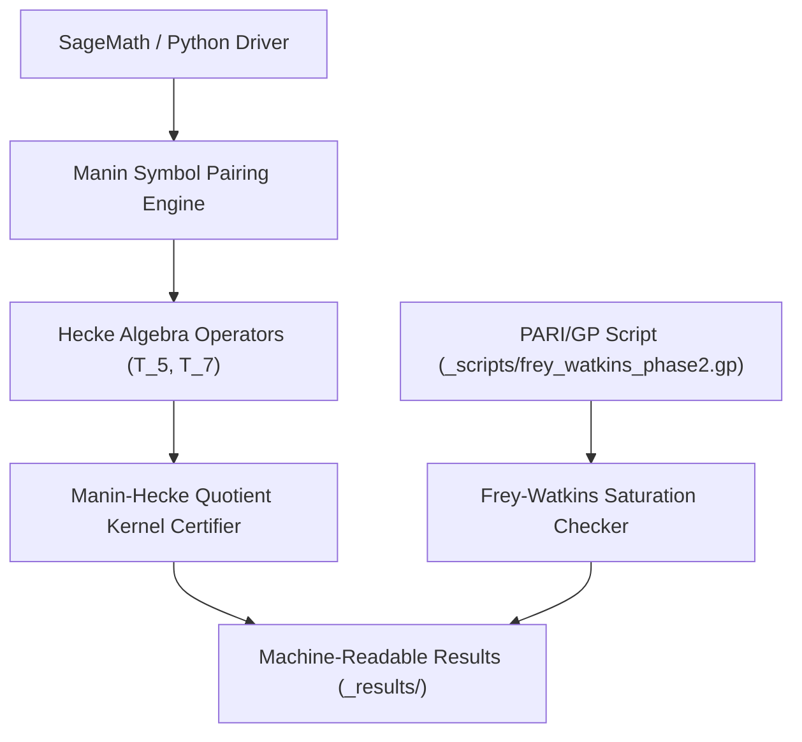

# abc-hct

Curated research repository for the HCT/abc research line.

> [!NOTE]
> Machine-readable repository context guidelines, canonical search phrases, and safety boundaries are maintained in [llms.txt](llms.txt).

## Quick Navigation

| Resource | Description |
|---|---|
| [llms.txt](llms.txt) | LLM context guidelines, search phrases & safety boundaries |
| [README_de.md](README_de.md) | Deutsche Dokumentationsfassung / German documentation parity |
| [CHANGELOG.md](CHANGELOG.md) | Release history and maintenance audit log |
| [REPRODUCIBILITY_H3A_2026-05-17.md](REPRODUCIBILITY_H3A_2026-05-17.md) | Overview of H3a reproducibility batch and certificates |

## System Architecture & Calculation Pipeline

## Sibling Research & Ecosystem Matrix

| Repository | Focus & Domain | Language / Stack | Status |
|---|---|---|---|
| [functional-stability-theory](https://github.com/research-line/functional-stability-theory) | Functional Stability Theory core framework & contract forms | Python / LaTeX | Active |
| [fst-nash](https://github.com/research-line/fst-nash) | Algorithmic game theory and evolutionary Nash equilibrium stability | Python / SageMath | Active |
| [economic-sanctions-coercive-diplomacy](https://github.com/research-line/economic-sanctions-coercive-diplomacy) | Formal quantitative analysis of economic sanctions & diplomacy | Python / LaTeX | Active |
| [prompt-archaeology-casestudy2](https://github.com/research-line/prompt-archaeology-casestudy2) | Prompt archaeology & LLM reasoning trajectory provenance | Python | Active |
| [CultureEvolution](https://github.com/research-line/CultureEvolution) | Cultural evolution models & multi-agent population dynamics | Python / Jupyter | Active |
| [connes-cvs](https://github.com/research-line/connes-cvs) | Connes trace formula & global field distributions | Python / SageMath | Active |
| [direct-beam](https://github.com/research-line/direct-beam) | Optical beam & diffraction pattern modeling | Python / NumPy | Active |
| [DevCenter](https://github.com/dev-bricks/DevCenter) | Developer workspace & project orchestration | TypeScript / Electron | Active |
| [CodeBox](https://github.com/dev-bricks/CodeBox) | Multi-language code execution & sandboxing | Rust / TypeScript | Active |

## Current Scope

- bilingual abc/HCT paper drafts,
- reproducible scripts for the no-Magma Manin-Hecke quotient route,
- curated machine-readable result artifacts needed for verification,
- publication-ready supplements after curation.

## Repository Policy

- Public since 2026-08-18 (DOI/public release gate reached: Paper A live since 2026-08-13, DOI [10.5281/zenodo.21916900](https://doi.org/10.5281/zenodo.21916900)).
- GitHub normally receives computation scripts and reproducible results, not internal proof notebooks.
- Do not push `BEWEISNOTIZ*`, `_proof-notes/`, handoffs, raw agent transcripts, credentials, or proof scratch by default.
- Internal control/state files such as `TODO.md`, `GAPS.md`, `AKTIONSPLAN.md`, `MEMORY.md`, `IDEENSPEICHER*.md`, local source caches, and raw `_data/` snapshots stay local by default.
- Internal proof notes become repo-publishable only after journal publication and explicit release as attached notes.
- Exploratory result notes become repo-eligible only together with the reproducer script they cite.
- Public release should contain only curated paper files, reproducibility scripts, selected results, and a clean disclosure/status note.

## Repository Hygiene

- GitHub Actions runs `abc-hct hygiene` on pushes and pull requests.
- The workflow performs syntax-only Python compilation for `_scripts/` and `_compute_queue/scripts/`.
- It executes the automated pytest test suite (`test_policy`, `test_metadata`, `test_scripts_compilation`).
- It also checks that the private-research `.gitignore` still excludes proof notes, handoffs, local state, raw data snapshots, and transient logs.
- Long calculations remain outside GitHub Actions and must use the project compute queue or a designated remote compute host.

## Primary Local Working Tree

This repository is curated from the local abc/HCT project root; host-specific absolute paths are intentionally omitted from version control.

## Current Computational Milestone

The no-Magma Sage/Python Manin-Hecke quotient over `GF(3863)` has killed the mapped basket `60168/80224/120336/240672` in both `raw` and `anc` modes. The remaining work is theoretical embedding, rank certification, and uniform FAQS/M* transfer.

## Evidence Mapping: Result <-> Reproducer <-> Paper

Every result category below is cited in at least one of the papers that this repository backs. `DOI` is the Zenodo concept DOI (always resolves to the latest version); `Paper`/`Reference` names the citing manuscript and, where the paper pins an exact filename, that filename.

| Result category | Levels / scope | Reproducer script(s) | Result files (`_results/`) | Cited by |
|---|---|---|---|---|
| No-Magma Manin-Hecke quotient (basket kill) | `60168, 80224, 120336, 240672` (`raw`+`anc`) over `GF(3863)` | `_scripts/mstar_nomagma_*.py` | `mstar_nomagma_*` (127 files) | Paper A "Global Congruence Routes"/"Hecke Diagnostics"; Paper B `mstar_nomagma_result_audit_2026-05-12.md`, `mstar_nomagma_rc3d_rowhash_60168_raw*_2026-05-12.md` |
| H3a residue-line witnesses (RC3c) | all 4 levels, `raw`+`anc` | `_scripts/mstar_h3a_*.py` | `mstar_h3a_*` (per-level witnesses, cusp-fan rank chains, prefix profiles) | Paper A "The bridge search" (Table 1, `raw`/`anc` per-level ledger); `REPRODUCIBILITY_H3A_2026-05-17.md` |
| M-DET block-rank / rank-drop-primes | `60168`, `240672` | `_scripts/mdet3_block_rank_60168.py` | `mdet3_block_rank_60168_2026-06-14.*`, `mdet_240672_rank_drop_primes_2026-06-13.*` | Paper B (exact filenames cited) |
| R1 faithful-AL Q_B-Schur certificate | `80224/raw` | Compute-queue job `r1_faithful_al_80224_raw_2026-06-14` + `r1_faithful_al_80224_raw_field_check_2026-06-27.py` (automated field check) | `r1_faithful_al_80224_raw_2026-06-14.*`, `r1_faithful_al_80224_raw_field_check_2026-06-27.*` | Paper B (exact filename cited; field-check added 2026-08-17, T-20260816-04) |
| Self-averaging diagnostic | quality tail, dyadic buckets | `_scripts/abc_quality_self_averaging_probe*.py` | `abc_quality_self_averaging_probe_2026-06-14.*` | Paper A "Self-averaging diagnostic" (`subsec:self_averaging`) |
| Frey-Watkins saturation (Phase 1-3b, h_delta) | 15 classical Frey triples + 60-point Sage sample | `_scripts/frey_watkins_phase2.gp`, `_scripts/frey_watkins_phase2.py`, `_scripts/frey_watkins_phase3.py`, `_scripts/frey_faltings_sandwich_phase3b.py` | `frey_watkins_saturation_phase*`, `frey_faltings_sandwich_phase3b_2026-05-17.*` | Paper A (naive-FWS-falsified / quality-conditional-FWS-c framing) |
| CX2/CX3 Codex-suggested kill-or-go tests | de-Smit-champion sample (n=230-240) | `_scripts/cx2_cx3_codex_tests.py` | `cx2_cx3_codex_tests_2026-06-11.*` | negative controls referenced across the programme's route audits |

`llms.txt` and `_compute_queue/README.md` carry the same mapping in machine-readable/queue form. Filenames a paper cites by exact path but that were not yet present here are treated as **open completeness gaps** and closed by adding the file (see `CHANGELOG.md` for closures made under this convention).

| Paper | DOI (concept) | Status |
|---|---|---|
| Paper A -- "From Landscape to Atlas: Multi-Route Cartography of an Ongoing Expedition Toward the *abc* Conjecture" | [10.5281/zenodo.21916900](https://doi.org/10.5281/zenodo.21916900) | live, versioned |
| Paper B -- "Beneath the *abc* Landscape: Hecke Quotients and the HCT Route" | not yet published | draft, unreleased |

**Proof notes:** the project's `_proof-notes/` directory holds >1000 exploratory/route notes. Per the pipeline's staged proof-note release policy, individual notes become repo-eligible only once terminal, paper-covered, cross-reference-clean, and privacy-hygienic (see `_templates`/`.RESEARCH/CLAUDE.md`, "Gestufte Proof-Note-Freigabe"). None have been individually cleared for this repository yet; that is a separate, ongoing curation task, not a blocker for the result/reproducer/paper mapping above.

## Latest Curated Batch

- `2026-05-17`: H3a/no-Magma reproduction scripts and machine-readable certificates were added under `_scripts/` and `_results/`.
- The batch includes the `240672/raw` standard certificate: `T_5` leaves quotient dimension `1`, then `T_7` kills the final line.
- Independent large-rank verification artifacts are added only when their result files exist; pending Mac verifier outputs are not represented as completed certificates.

## Frey-Watkins Exploratory Batch

- `2026-05-17`: Phase-1/Phase-2 Frey-Watkins saturation outputs were added under `_results/`.
- `_scripts/frey_watkins_phase2.gp` reproduces the PARI/GP Phase-2 calculation for 15 classical Frey triples.
- `_scripts/frey_watkins_phase2.py` is a Sage/Python helper with the same Phase-2 triple list.
- Main result: naive universal `log m / log N >= 1` is falsified on the sample, while the quality-conditional pattern `rho >= (q-1)+c` remains empirically supported.

## LLM Context

- [LLM context](llms.txt) contains canonical links, interfaces, search phrases, and safety boundaries for AI coding assistants.
