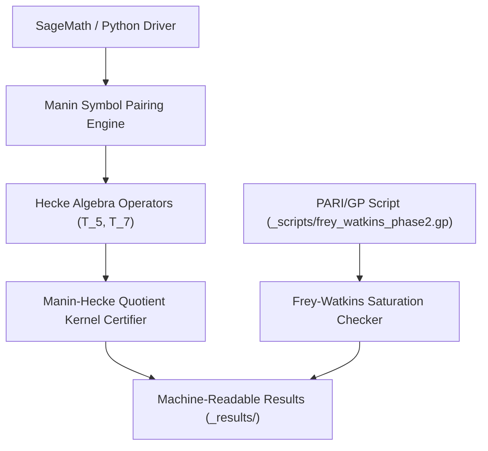

# abc-hct

Private working repository for the HCT/abc research line.

> [!NOTE]
> Machine-readable repository context guidelines, canonical search phrases, and safety boundaries are maintained in [llms.txt](llms.txt).

## Quick Navigation

| Resource | Description |
|---|---|
| [llms.txt](llms.txt) | LLM context guidelines, search phrases & safety boundaries |
| [README_de.md](README_de.md) | Deutsche Dokumentationsfassung / German documentation parity |
| [CHANGELOG.md](CHANGELOG.md) | Release history and maintenance audit log |
| [REPRODUCIBILITY_H3A_2026-05-17.md](REPRODUCIBILITY_H3A_2026-05-17.md) | Overview of H3a reproducibility batch and certificates |

## System Architecture & Calculation Pipeline

Current scope:

- bilingual abc/HCT paper drafts,
- reproducible scripts for the no-Magma Manin-Hecke quotient route,
- curated machine-readable result artifacts needed for verification,
- publication-ready supplements after curation.

Repository policy:

- Keep this repository private until the corresponding DOI/public release gate is reached.
- GitHub normally receives computation scripts and reproducible results, not internal proof notebooks.
- Do not push `BEWEISNOTIZ*`, `_proof-notes/`, handoffs, raw agent transcripts, credentials, or proof scratch by default.
- Internal control/state files such as `TODO.md`, `GAPS.md`, `AKTIONSPLAN.md`, `MEMORY.md`, `IDEENSPEICHER*.md`, local source caches, and raw `_data/` snapshots stay local by default.
- Internal proof notes become repo-publishable only after journal publication and explicit release as attached notes.
- Exploratory result notes become repo-eligible only together with the reproducer script they cite.
- Public release should contain only curated paper files, reproducibility scripts, selected results, and a clean disclosure/status note.

Repository hygiene:

- GitHub Actions runs `abc-hct hygiene` on pushes and pull requests.
- The workflow performs syntax-only Python compilation for `_scripts/` and `_compute_queue/scripts/`.
- It also checks that the private-research `.gitignore` still excludes proof notes, handoffs, local state, raw data snapshots, and transient logs.
- Long calculations remain outside GitHub Actions and must use the project compute queue or a designated remote compute host.

Primary local working tree:

This repository is curated from the local abc/HCT project root; host-specific absolute paths are intentionally omitted from version control.

Current computational milestone:

The no-Magma Sage/Python Manin-Hecke quotient over `GF(3863)` has killed the mapped basket `60168/80224/120336/240672` in both `raw` and `anc` modes. The remaining work is theoretical embedding, rank certification, and uniform FAQS/M* transfer.

Latest curated batch:

- `2026-05-17`: H3a/no-Magma reproduction scripts and machine-readable certificates were added under `_scripts/` and `_results/`.
- The batch includes the `240672/raw` standard certificate: `T_5` leaves quotient dimension `1`, then `T_7` kills the final line.
- Independent large-rank verification artifacts are added only when their result files exist; pending Mac verifier outputs are not represented as completed certificates.

Frey-Watkins exploratory batch:

- `2026-05-17`: Phase-1/Phase-2 Frey-Watkins saturation outputs were added under `_results/`.
- `_scripts/frey_watkins_phase2.gp` reproduces the PARI/GP Phase-2 calculation for 15 classical Frey triples.
- `_scripts/frey_watkins_phase2.py` is a Sage/Python helper with the same Phase-2 triple list.
- Main result: naive universal `log m / log N >= 1` is falsified on the sample, while the quality-conditional pattern `rho >= (q-1)+c` remains empirically supported.

## LLM Context

- [LLM context](llms.txt) contains canonical links, interfaces, search phrases, and safety boundaries for AI coding assistants.
