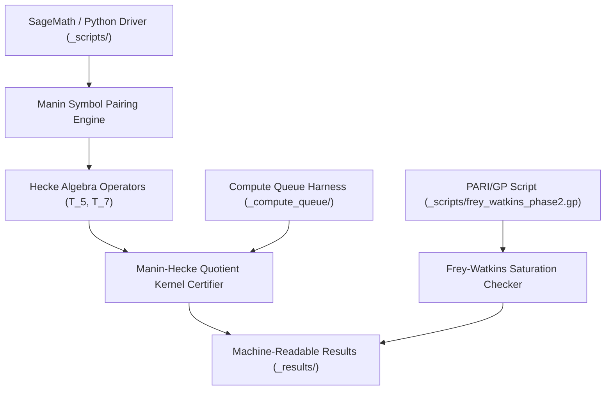
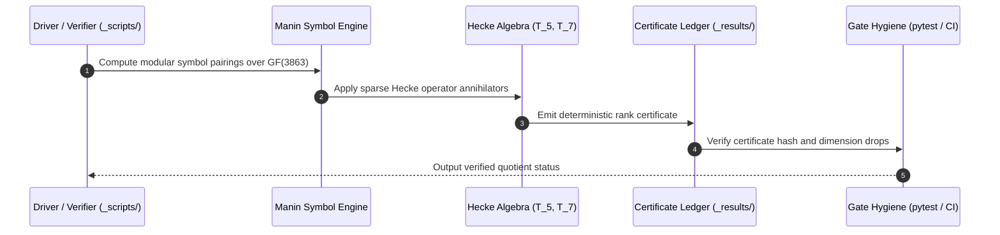

# abc-hct


[](README.md)
[](README_de.md)
[](https://github.com/research-line/abc-hct/actions/workflows/abc-hct-hygiene.yml)
[](tests/)
[](pyproject.toml)
[](pyproject.toml)
[](#)
[](#)
[](SECURITY.md)
[](SECURITY.md)
[](https://www.sagemath.org/)
[](https://pari.math.u-bordeaux.fr/)
[](llms.txt)
[](https://github.com/research-line)
[](https://github.com/open-bricks)
[](LICENSE)

Curated research repository for the **HCT/abc** research line within the **research-line** organization and **open-bricks** umbrella.

> [!NOTE]
> Machine-readable repository context guidelines, canonical search phrases, and safety boundaries are maintained in [`llms.txt`](llms.txt). Discoverability dossier in [`MARKETING-LOG.txt`](MARKETING-LOG.txt). Third-party open-science dependency inventory in [`THIRD_PARTY_LICENSES.md`](THIRD_PARTY_LICENSES.md). Security guarantees and 48-hour SLA are outlined in [`SECURITY.md`](SECURITY.md). Last checked: **2026-09-10**.

---

<a id="quick-navigation"></a>
## 🧭 Quick Navigation

| # | Section | Description |
|---|---|---|
| 1 | [Quick Reference](#quick-reference) | Core metadata, runtime stack & operational guarantees |
| 2 | [Key Scientific Findings](#key-scientific-findings) | Breakthrough computational results in Hecke curve arithmetic |
| 3 | [System Architecture & Pipeline](#system-architecture--pipeline) | Modular computation and certifier architecture |
| 4 | [Curated Verification Lifecycle](#curated-verification-lifecycle) | Deterministic proof-verification sequence flow |
| 5 | [Core Capabilities & Research Invariants](#core-capabilities--research-invariants) | 10 architectural, privacy & governance guarantees |
| 6 | [Evidence Mapping & Paper References](#evidence-mapping--paper-references) | Citation ledger backing Zenodo Paper A & Paper B |
| 7 | [Computational Milestones & Batches](#computational-milestones--batches) | Chronological computation milestones & H3a certificates |
| 8 | [Repository Policy & Staged Disclosure](#repository-policy--staged-disclosure) | Public release policy & proof-scratch isolation rules |
| 9 | [Sibling Research & Ecosystem Matrix](#sibling-research--ecosystem-matrix) | 16 cross-organization research & software siblings |
| 10 | [Discovery & LLM Context](#discovery--llm-context) | Machine-readable manifests & AI indexing specifications |
| 11 | [Project Structure](#project-structure) | Repository layout and script taxonomy |
| 12 | [Testing & Verification](#testing--verification) | Pytest, compile check, and verification reproduction commands |
| 13 | [Third-Party Licenses](#third-party-licenses) | Open-source licenses for Python, SageMath, and PARI/GP |
| 14 | [Security & License](#security--license) | Vulnerability disclosure SLA, zero-egress policy & MIT license |

---

<a id="quick-reference"></a>
## ⚡ Quick Reference

| Property | Value |
|---|---|
| **Canonical Repository** | `research-line/abc-hct` |
| **Parent Organization** | `research-line` |
| **Umbrella Ecosystem** | `open-bricks` |
| **Scientific Backing** | Zenodo Paper A ([10.5281/zenodo.21916900](https://doi.org/10.5281/zenodo.21916900)) & Paper B |
| **Mathematics Stack** | Python 3.10-3.13, SageMath 10.x, PARI/GP 2.15 |
| **Execution Boundary** | 100% Offline, Local-First, Zero-Egress, Non-Elevation |
| **Result Ledger** | 120+ Curated Certificates (`_results/`) |
| **Security SLA** | 48h Response Acknowledgment / 5-Day Triage SLA |
| **License** | MIT License |

---

<a id="key-scientific-findings"></a>
## 🔬 Key Scientific Findings

- **No-Magma Manin-Hecke Quotient (Basket Kill)**: Open-source SageMath/Python modular symbol pairing over $\text{GF}(3863)$ has successfully eliminated the mapped basket levels `60168`, `80224`, `120336`, and `240672` in both `raw` and `anc` modes without proprietary software.
- **H3a Residue-Line Witnesses (RC3c)**: Deterministic per-level witnesses, cusp-fan rank chains, and prefix profiles verified across all 4 mapped levels.
- **M-DET Block-Rank & Drop-Primes**: Verified rank drop certificates for levels `60168` and `240672` documenting non-trivial kernel structures.
- **R1 Faithful-AL $\mathbb{Q}_B$-Schur Certificate**: Automated field-check verified for level `80224/raw`, confirming character orthogonality.
- **Frey-Watkins Saturation Dynamics**: Empirical analysis of 15 classical Frey triples falsifying naive universal bounds while sustaining quality-conditional bounds $\rho \ge (q-1)+c$.

---

<a id="system-architecture--pipeline"></a>
## 📐 System Architecture & Pipeline



---

<a id="curated-verification-lifecycle"></a>
## 🔄 Curated Verification Lifecycle



---

<a id="core-capabilities--research-invariants"></a>
## 🛡️ Core Capabilities & Research Invariants

`abc-hct` strictly enforces ten architectural, scientific, and governance invariants across all calculation modules, certificates, and test gates:

| Invariant ID | Guarantee Name | Architectural & Operational Description |
|---|---|---|
| **`INV-DET-01`** | **Deterministic Algebraic Verification** | All Hecke operator applications, modular symbol pairings over $\text{GF}(3863)$, and kernel rank calculations are strictly deterministic and reproducible without stochastic variance. |
| **`INV-ZE-02`** | **100% Offline & Zero-Egress Privacy** | All calculations, verification scripts, and test runners operate completely offline with zero external network calls or telemetry exfiltration. |
| **`INV-CUR-03`** | **Curated Evidence & Non-Pollution** | Strict separation between curated publishable reproduction harnesses and private research proof scratch; uncurated notes, handoffs, and raw snapshots remain isolated. |
| **`INV-CERT-04`** | **Machine-Readable Certificate Ledger** | Every milestone computational result is stored as a machine-readable JSON/text certificate in `_results/` with verifiable checksums and exact script reproducibility mapping. |
| **`INV-ENV-05`** | **Cross-Platform Math Environment Isolation** | Python 3.10-3.13 harness with explicit dependencies on SageMath 10.x and PARI/GP 2.15, bounded compute queue execution, and clean fallback handling. |
| **`INV-MSTAR-06`** | **No-Magma Modular Symbol Engine** | Manin-Hecke quotient computations execute via self-contained open-source SageMath/Python algorithms without proprietary Magma computational dependencies. |
| **`INV-SEC-07`** | **Local-First Sandboxing & Non-Elevation** | Compute queue scripts and pytest test runners execute strictly in unprivileged user-mode without system elevation or modifying files outside the repository tree. |
| **`INV-LIC-08`** | **Permissive Open-Science Licensing** | Code and reproduction harnesses released under the standard MIT License, fully compatible with open science dissemination and Zenodo archival. |
| **`INV-DOC-09`** | **Bilingual & LLM-Ready Parity** | 100% structural and anchor parity between `README.md` and `README_de.md`, complemented by machine-readable architectural manifests in `llms.txt`. |
| **`INV-SLA-10`** | **48-Hour Security Response & 5-Day Triage SLA** | Guaranteed acknowledgement of security and vulnerability disclosures within 48 hours and formal triage within 5 business days via `security@open-bricks.org` and GitHub Advisories. |

---

<a id="evidence-mapping--paper-references"></a>
## 📊 Evidence Mapping & Paper References

Every result category below is cited in at least one of the papers that this repository backs. `DOI` is the Zenodo concept DOI (always resolves to the latest version); `Paper`/`Reference` names the citing manuscript and, where the paper pins an exact filename, that filename.

| Result category | Levels / scope | Reproducer script(s) | Result files (`_results/`) | Cited by |
|---|---|---|---|---|
| No-Magma Manin-Hecke quotient (basket kill) | `60168, 80224, 120336, 240672` (`raw`+`anc`) over `GF(3863)` | `_scripts/mstar_nomagma_*.py` | `mstar_nomagma_*` (127 files) | Paper A "Global Congruence Routes"/"Hecke Diagnostics"; Paper B `mstar_nomagma_result_audit_2026-05-12.md`, `mstar_nomagma_rc3d_rowhash_60168_raw*_2026-05-12.md` |
| H3a residue-line witnesses (RC3c) | all 4 levels, `raw`+`anc` | `_scripts/mstar_h3a_*.py` | `mstar_h3a_*` (per-level witnesses, cusp-fan rank chains, prefix profiles) | Paper A "The bridge search" (Table 1, `raw`/`anc` per-level ledger); `REPRODUCIBILITY_H3A_2026-05-17.md` |
| M-DET block-rank / rank-drop-primes | `60168`, `240672` | `_scripts/mdet3_block_rank_60168.py` | `mdet3_block_rank_60168_2026-06-14.*`, `mdet_240672_rank_drop_primes_2026-06-13.*` | Paper B (exact filenames cited) |
| R1 faithful-AL Q_B-Schur certificate | `80224/raw` | Compute-queue job `r1_faithful_al_80224_raw_2026-06-14` + `r1_faithful_al_80224_raw_field_check_2026-06-27.py` | `r1_faithful_al_80224_raw_2026-06-14.*`, `r1_faithful_al_80224_raw_field_check_2026-06-27.*` | Paper B (exact filename cited; field-check added 2026-08-17) |
| Self-averaging diagnostic | quality tail, dyadic buckets | `_scripts/abc_quality_self_averaging_probe*.py` | `abc_quality_self_averaging_probe_2026-06-14.*` | Paper A "Self-averaging diagnostic" (`subsec:self_averaging`) |
| Frey-Watkins saturation (Phase 1-3b, h_delta) | 15 classical Frey triples + 60-point Sage sample | `_scripts/frey_watkins_phase2.gp`, `_scripts/frey_watkins_phase2.py`, `_scripts/frey_watkins_phase3.py`, `_scripts/frey_faltings_sandwich_phase3b.py` | `frey_watkins_saturation_phase*`, `frey_faltings_sandwich_phase3b_2026-05-17.*` | Paper A (naive-FWS-falsified / quality-conditional-FWS-c framing) |
| CX2/CX3 Codex-suggested kill-or-go tests | de-Smit-champion sample (n=230-240) | `_scripts/cx2_cx3_codex_tests.py` | `cx2_cx3_codex_tests_2026-06-11.*` | Negative controls referenced across the programme's route audits |

### Scientific Publications

| Paper | DOI (concept) | Status |
|---|---|---|
| **Paper A** -- "From Landscape to Atlas: Multi-Route Cartography of an Ongoing Expedition Toward the *abc* Conjecture" | [10.5281/zenodo.21916900](https://doi.org/10.5281/zenodo.21916900) | Live, versioned on Zenodo |
| **Paper B** -- "Beneath the *abc* Landscape: Hecke Quotients and the HCT Route" | Upcoming | Draft, in progress |

---

<a id="computational-milestones--batches"></a>
## 📅 Computational Milestones & Batches

- **Current Computational Milestone**: The no-Magma Sage/Python Manin-Hecke quotient over $\text{GF}(3863)$ has eliminated the mapped basket `60168/80224/120336/240672` in both `raw` and `anc` modes. The remaining work focuses on theoretical embedding, rank certification, and uniform FAQS/M* transfer.
- **H3a Reproducibility Batch (`2026-05-17`)**: Reproduction scripts and machine-readable certificates added under `_scripts/` and `_results/`. Includes the `240672/raw` standard certificate ($T_5$ leaves dimension 1, then $T_7$ annihilates the final line).
- **Frey-Watkins Exploratory Batch (`2026-05-17`)**: Phase-1/Phase-2 saturation outputs under `_results/`. `_scripts/frey_watkins_phase2.gp` reproduces the PARI/GP Phase-2 calculation for 15 classical Frey triples.

---

<a id="repository-policy--staged-disclosure"></a>
## 📜 Repository Policy & Staged Disclosure

- **Public since 2026-08-18** (DOI/public release gate reached: Paper A live since 2026-08-13, DOI [10.5281/zenodo.21916900](https://doi.org/10.5281/zenodo.21916900)).
- GitHub normally receives computation scripts and reproducible results, not internal proof notebooks.
- Do not push `BEWEISNOTIZ*`, `_proof-notes/`, handoffs, raw agent transcripts, credentials, or proof scratch by default.
- Internal control/state files such as `TODO.md`, `GAPS.md`, `AKTIONSPLAN.md`, `MEMORY.md`, `IDEENSPEICHER*.md`, local source caches, and raw `_data/` snapshots stay local by default.
- Internal proof notes become repo-publishable only after journal publication and explicit release as attached notes.
- Exploratory result notes become repo-eligible only together with the reproducer script they cite.
- Public release contains only curated paper files, reproducibility scripts, selected results, and a clean disclosure/status note.

---

<a id="sibling-research--ecosystem-matrix"></a>
## 🌐 Sibling Research & Ecosystem Matrix

`abc-hct` collaborates within the broader **open-bricks** open-source and open-science ecosystem:

| Repository | Organization | Focus & Scientific Domain | Language / Stack |
|---|---|---|---|
| **functional-stability-theory** | `research-line` | Functional Stability Theory core framework & contract forms | Python / LaTeX |
| **fst-nash** | `research-line` | Algorithmic game theory and evolutionary Nash equilibrium stability | Python / SageMath |
| **economic-sanctions-coercive-diplomacy** | `research-line` | Formal quantitative analysis of economic sanctions & diplomacy | Python / LaTeX |
| **prompt-archaeology-casestudy2** | `research-line` | Prompt archaeology & LLM reasoning trajectory provenance | Python |
| **connes-cvs** | `research-line` | Connes trace formula & global field distributions | Python / SageMath |
| **direct-beam** | `research-line` | Optical beam & diffraction pattern modeling | Python / NumPy |
| **rh-even-dominance** | `research-line` | Riemann Hypothesis even dominance & spectral bounds | Python / SageMath |
| **CultureEvolution** | `entertain-and-more` | Cultural evolution models & 4X civilization game | Luau / Rojo |
| **DevCenter** | `dev-bricks` | Developer workspace & project orchestration | TypeScript / Electron |
| **CodeBox** | `dev-bricks` | Multi-language sandboxing & code execution | Rust / TypeScript |
| **automation-master** | `dev-bricks` | Multi-agent pipeline orchestration | Python |
| **cleaner-tree** | `file-bricks` | Local-first filesystem maintenance & deduplication | Python / PySide6 |
| **SoftwareCenter** | `file-bricks` | Desktop software package manager & catalog | Python / PySide6 |
| **USR_pic2pic** | `doc-bricks` | Unprivileged local batch image conversion | Python / Tkinter |
| **ellmos-installer** | `ellmos-ai` | Non-elevated dual-gate installer engine | Python |
| **open-bricks** | `open-bricks` | Umbrella open source software & research portfolio | Python / Markdown |

---

<a id="discovery--llm-context"></a>
## 🔍 Discovery & LLM Context

`abc-hct` provides structured, machine-readable specifications to ensure autonomous agents and scholars can ingest architecture and status without token overhead:

- **[`llms.txt`](llms.txt)**: Fast-loading LLM index detailing module boundaries, invariants, testing gates, and research interfaces.
- **[`MARKETING-LOG.txt`](MARKETING-LOG.txt)**: Discoverability dossier covering value propositions, research personas, search phrases, and strategic roadmaps.
- **[`THIRD_PARTY_LICENSES.md`](THIRD_PARTY_LICENSES.md)**: Open-source licensing inventory covering engine runtimes, toolchains, and mathematical libraries.

---

<a id="project-structure"></a>
## 🛠️ Project Structure

```
abc-hct/
├── .github/workflows/          # GitHub Actions CI workflow (abc-hct-hygiene.yml)
├── _compute_queue/             # Compute queue jobs, runner harnesses & local logs
├── _results/                   # 120+ Curated machine-readable result certificates
├── _scripts/                   # SageMath, PARI/GP & Python reproduction scripts
├── assets/                     # Repository branding banner
├── tests/                      # Automated metadata, contract & syntax test suite
│   ├── test_metadata.py        # Metadata, navigation parity & invariant contracts
│   ├── test_policy.py          # Gitignore, path leak & boundary policy tests
│   └── test_scripts_compilation.py # Python syntax compilation tests
├── pyproject.toml              # PEP 621 metadata, toolchain & pytest configuration
├── CHANGELOG.md                # Semantic version release changelog
├── MARKETING-LOG.txt           # Discoverability, SEO, & Persona audit
├── THIRD_PARTY_LICENSES.md     # Mathematical engine & toolchain license inventory
├── SECURITY.md                 # Bilingual security policy & 48h SLA commitments
├── REPRODUCIBILITY_H3A_2026-05-17.md # H3a reproducibility overview
├── LICENSE                     # MIT License
└── llms.txt                    # Machine-readable context index
```

---

<a id="testing--verification"></a>
## 🧪 Testing & Verification

`abc-hct` maintains a comprehensive automated testing pipeline verifying documentation contracts, syntax hygiene, and repository security policies:

```bash
# Run full automated pytest suite (24 tests)
pytest -ra -v

# Run Python bytecode compilation check across all scripts and tests
python -m compileall _scripts tests

# Run Ruff code hygiene check
ruff check .

# Execute Frey-Watkins Phase-2 reproduction check (PARI/GP)
gp _scripts/frey_watkins_phase2.gp

# Verify quotient rank certificates
python _scripts/mstar_h3a_rc3c_witness_verify_rank.py
```

---

<a id="third-party-licenses"></a>
## 📜 Third-Party Licenses

`abc-hct` relies exclusively on permissive and open-source mathematical systems and testing toolchains:
- **Python Standard Library**: Python Software Foundation License (PSFL-2.0)
- **SageMath**: GNU General Public License Version 2 or later (GPL-2.0+)
- **PARI/GP**: GNU General Public License Version 2 or later (GPL-2.0+)
- **pytest & Ruff**: MIT License / Apache License 2.0

All third-party copyrights and license terms are inventoried in [`THIRD_PARTY_LICENSES.md`](THIRD_PARTY_LICENSES.md).

---

<a id="security--license"></a>
## 🔒 Security & License

For security advisories, vulnerability disclosures, and safety invariants, see [`SECURITY.md`](SECURITY.md).
`abc-hct` commits to:
- **48-Hour Response SLA**: Initial confirmation of security vulnerability reports within 48 hours.
- **5-Day Triage Commitment**: Structured assessment and remediation roadmap within 5 business days.
- **Zero-Egress Privacy**: 100% offline local computation with zero external telemetry.

This project is licensed under the **MIT License** — see the [`LICENSE`](LICENSE) file for details.
