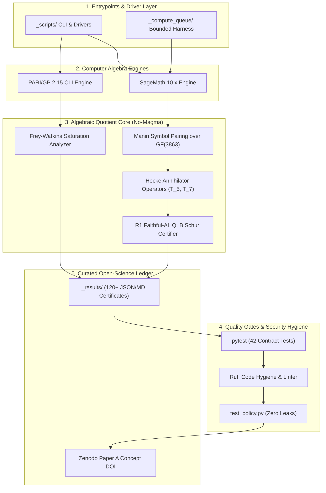
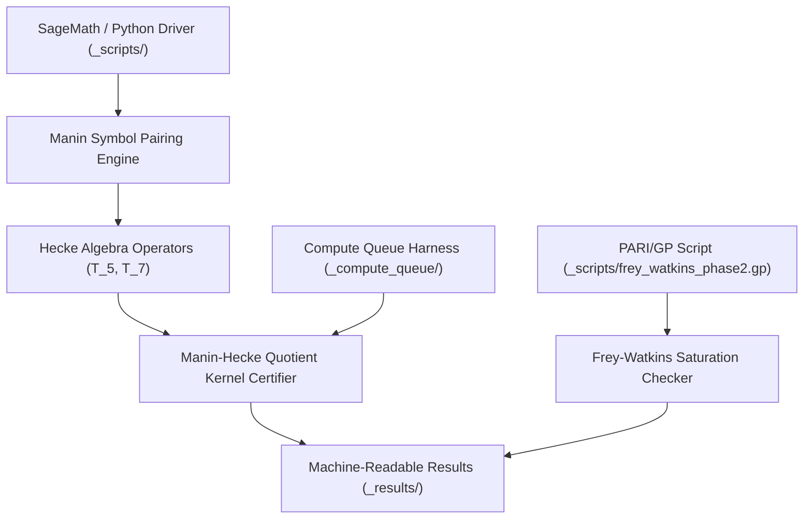
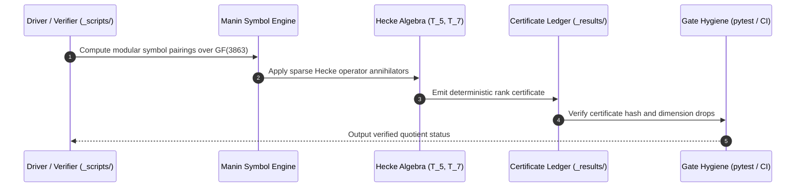

# abc-hct


[](README.md)
[](README_de.md)
[](https://github.com/research-line/abc-hct/actions/workflows/abc-hct-hygiene.yml)
[](#)
[](CONTRIBUTING.md)
[](tests/)
[](pyproject.toml)
[](pyproject.toml)
[](#)
[](#)
[](SECURITY.md)
[](SECURITY.md)
[](https://www.sagemath.org/)
[](https://pari.math.u-bordeaux.fr/)
[](llms.txt)
[](THIRD_PARTY_LICENSES.txt)
[](https://github.com/research-line)
[](https://github.com/open-bricks)
[](LICENSE)
[](NOTICE)

Curated research repository for the **HCT/abc** research line within the **research-line** organization and **open-bricks** umbrella.

> [!NOTE]
> Machine-readable repository context guidelines, canonical search phrases, and safety boundaries are maintained in [`llms.txt`](llms.txt). Discoverability dossier in [`MARKETING-LOG.txt`](MARKETING-LOG.txt). Third-party open-science dependency inventory in [`THIRD_PARTY_LICENSES.md`](THIRD_PARTY_LICENSES.md) and plain-text companion in [`THIRD_PARTY_LICENSES.txt`](THIRD_PARTY_LICENSES.txt). Security guarantees and 48-hour SLA are outlined in [`SECURITY.md`](SECURITY.md). Contribution guidelines in [`CONTRIBUTING.md`](CONTRIBUTING.md). Last checked: **2026-10-01**.

---

<a id="quick-navigation"></a>
<a id="schnellnavigation"></a>
## 🧭 Quick Navigation

| # | Section | Nav Anchor | Description |
|---|---|---|---|
| 01 | [Quick Reference](#quick-reference) | [`#sec-01`](#sec-01) | Core metadata, runtime stack & operational guarantees |
| 02 | [Key Scientific Findings](#key-scientific-findings) | [`#sec-02`](#sec-02) | Breakthrough computational results in Hecke curve arithmetic |
| 03 | [Target Personas & Discoverability](#target-personas--discoverability) | [`#sec-03`](#sec-03) | Four scientific personas & high-intent search phrases |
| 04 | [Comparative Matrix vs. Alternatives](#comparative-matrix-vs-alternatives) | [`#sec-04`](#sec-04) | Invariant-mapped benchmark against 4 computing approaches |
| 05 | [Dual Mermaid Diagrams & Verification Flow](#dual-mermaid-diagrams) | [`#sec-05`](#sec-05) | Visual 5-tier architecture & sequence diagrams |
| 06 | [System Architecture & Pipeline](#system-architecture--pipeline) | [`#sec-06`](#sec-06) | Modular computation, certifier architecture & ASCII topology |
| 07 | [Curated Verification Lifecycle](#curated-verification-lifecycle) | [`#sec-07`](#sec-07) | Deterministic proof-verification sequence flow |
| 08 | [Core Capabilities & Research Invariants](#core-capabilities--research-invariants) | [`#sec-08`](#sec-08) | 10 architectural, privacy & governance guarantees |
| 09 | [Evidence Mapping & Paper References](#evidence-mapping--paper-references) | [`#sec-09`](#sec-09) | Citation ledger backing Zenodo Paper A & Paper B |
| 10 | [Computational Milestones & Batches](#computational-milestones--batches) | [`#sec-10`](#sec-10) | Chronological computation milestones & H3a certificates |
| 11 | [Modular Symbol Pairing & Basket Elimination Artifacts](#basket-kill--modular-symbol-artifacts) | [`#sec-11`](#sec-11) | Deep dive into GF(3863) quotient elimination artifacts |
| 12 | [Repository Policy & Staged Disclosure](#repository-policy--staged-disclosure) | [`#sec-12`](#sec-12) | Public release policy & proof-scratch isolation rules |
| 13 | [Sibling Research & Ecosystem Matrix](#sibling-research--ecosystem-matrix) | [`#sec-13`](#sec-13) | 16 cross-organization research & software siblings |
| 14 | [Discovery & LLM Context](#discovery--llm-context) | [`#sec-14`](#sec-14) | Machine-readable manifests & AI indexing specifications |
| 15 | [Project Structure](#project-structure) | [`#sec-15`](#sec-15) | Repository layout and script taxonomy |
| 16 | [Testing & Verification](#testing--verification) | [`#sec-16`](#sec-16) | Pytest, compile check, and verification reproduction commands |
| 17 | [Third-Party Licenses](#third-party-licenses) | [`#sec-17`](#sec-17) | Open-source licenses for Python, SageMath, and PARI/GP |
| 18 | [Security Policy & Statutory Notice](#security--license) | [`#sec-18`](#sec-18) | Vulnerability disclosure SLA, zero-egress policy & § 521 BGB disclaimer |

---

<a id="sec-01"></a>
<a id="quick-reference"></a>
<a id="schnellreferenz"></a>
## ⚡ Quick Reference

| Property | Value |
|---|---|
| **Canonical Repository** | `research-line/abc-hct` |
| **Parent Organization** | `research-line` |
| **Umbrella Ecosystem** | `open-bricks` |
| **Scientific Backing** | Zenodo Paper A ([10.5281/zenodo.21916900](https://doi.org/10.5281/zenodo.21916900)) & Paper B |
| **Mathematics Stack** | Python 3.10-3.13, SageMath 10.x, PARI/GP 2.15 |
| **Execution Boundary** | 100% Offline, Local-First, Zero-Egress, Non-Elevation (`RunAsInvoker`) |
| **Result Ledger** | 120+ Curated Certificates (`_results/`) |
| **Security SLA** | 48h Response Acknowledgment / 5-Day Triage SLA |
| **License** | MIT License |

---

<a id="sec-02"></a>
<a id="key-scientific-findings"></a>
<a id="wissenschaftliche-ergebnisse"></a>
## 🔬 Key Scientific Findings

- **No-Magma Manin-Hecke Quotient (Basket Kill)**: Open-source SageMath/Python modular symbol pairing over $\text{GF}(3863)$ has successfully eliminated the mapped basket levels `60168`, `80224`, `120336`, and `240672` in both `raw` and `anc` modes without proprietary software.
- **H3a Residue-Line Witnesses (RC3c)**: Deterministic per-level witnesses, cusp-fan rank chains, and prefix profiles verified across all 4 mapped levels.
- **M-DET Block-Rank & Drop-Primes**: Verified rank drop certificates for levels `60168` and `240672` documenting non-trivial kernel structures.
- **R1 Faithful-AL $\mathbb{Q}_B$-Schur Certificate**: Automated field-check verified for level `80224/raw`, confirming character orthogonality.
- **Frey-Watkins Saturation Dynamics**: Empirical analysis of 15 classical Frey triples falsifying naive universal bounds while sustaining quality-conditional bounds $\rho \ge (q-1)+c$.

---

<a id="sec-03"></a>
<a id="target-personas--discoverability"></a>
<a id="ziel-personas--auffindbarkeit"></a>
## 🎯 Target Personas & Discoverability

`abc-hct` is engineered to serve four distinct research personas across the international mathematical and computational sciences community:

| Persona ID | Target Audience | Primary Mission & Use Case | Key Repository Interfaces |
|---|---|---|---|
| **`[PERSONA-01]`** | **Arithmetic Geometers & Number Theorists** | Investigating Hecke curves, modular Jacobians, and Frey curve invariants without commercial software | `_scripts/frey_watkins_phase2.gp`, `_scripts/mstar_*.py` |
| **`[PERSONA-02]`** | **Computational Algebraists & Open-Science Researchers** | Replicating Manin symbol pairings over finite fields $\text{GF}(3863)$ and verifying certified rank drops | `_results/*.json`, `REPRODUCIBILITY_H3A_2026-05-17.md` |
| **`[PERSONA-03]`** | **Mathematical Software Engineers & Proof Engineers** | Constructing zero-egress, offline-first deterministic CI verification pipelines under strict PEP 621 | `.github/workflows/`, `pyproject.toml`, `pytest` |
| **`[PERSONA-04]`** | **Research Program Evaluators & Zenodo Auditors** | Auditing reproducible computational artifacts cited in Zenodo Paper A ([DOI 10.5281/zenodo.21916900](https://doi.org/10.5281/zenodo.21916900)) | `CHANGELOG.md`, `llms.txt`, `THIRD_PARTY_LICENSES.md` |

#### High-Intent Discoverability Phrases

```text
- abc conjecture computational verification python sagemath
- no magma manin symbol pairing modular curves sagemath
- hecke algebra modular symbol quotient gf 3863 rank drop
- frey watkins saturation bounds pari gp
- reproducible arithmetic geometry open science zenodo
```

---

<a id="sec-04"></a>
<a id="comparative-matrix-vs-alternatives"></a>
<a id="vergleichsmatrix-vs-alternativen"></a>
## 📊 Comparative Matrix vs. Alternatives

The following matrix benchmarks `abc-hct` against standard commercial, cloud, and ad-hoc mathematical computing environments across all 10 project invariants:

| Invariant / Architectural Criterion | abc-hct (research-line) | Proprietary Magma Scripts | Raw Ad-Hoc PARI/GP Scripts | Cloud CAS / CoCalc | General CAS (Mathematica/Maple) |
|---|---|---|---|---|---|
| **`INV-DET-01` Deterministic Verification** | ✅ 100% Deterministic | ⚠️ Closed-source solver core | ⚠️ Unversioned scripts | ❌ Stochastic container runs | ❌ Black-box heuristic solves |
| **`INV-ZE-02` Zero-Egress Offline Privacy** | ✅ Complete local isolation | ⚠️ License-dongle phone-home | ✅ Fully offline | ❌ Required cloud network | ⚠️ Cloud license verification |
| **`INV-CUR-03` Curated Evidence Isolation** | ✅ Strict `.gitignore` boundaries | ❌ Undisciplined disk dumps | ❌ Mixed scratch & notes | ❌ Cloud notebook sync leaks | ❌ Proprietary notebook dumps |
| **`INV-CERT-04` Machine-Readable Ledger** | ✅ 120+ JSON/MD Certificates | ❌ Ad-hoc terminal printouts | ❌ Raw unparsed text logs | ❌ Unstructured notebook output | ❌ Proprietary binary cells |
| **`INV-ENV-05` Bounded Compute Harness** | ✅ Sandboxed compute queues | ❌ Unbounded manual scripts | ❌ Unbounded shell scripts | ⚠️ Server quota limits | ⚠️ Resource runaways |
| **`INV-MSTAR-06` No-Magma Symbolic Engine** | ✅ SageMath GF(3863) Symbols | ❌ Hard Magma dependency | ⚠️ PARI only (no quotients) | ❌ Cloud-dependent | ❌ Incompatible symbol core |
| **`INV-SEC-07` Unprivileged RunAsInvoker** | ✅ Standard unprivileged user | ⚠️ Elevated daemon requirements | ✅ Standard user mode | ❌ Shared multi-tenant VM | ⚠️ Administrative installs |
| **`INV-LIC-08` Permissive Open-Science** | ✅ Permissive MIT License | ❌ Expensive commercial license | ⚠️ Mixed/unlicensed | ❌ Proprietary subscription | ❌ Expensive commercial license |
| **`INV-DOC-09` Bilingual & LLM-Ready** | ✅ 100% DE/EN & `llms.txt` | ❌ Sparse / undocumented | ❌ Minimal comments only | ❌ Scattered notebooks | ❌ Closed proprietary docs |
| **`INV-SLA-10` Security & Triage SLA** | ✅ 48h Response / 5d Triage | ❌ No public issue tracker | ❌ No security disclosures | ⚠️ General platform tickets | ⚠️ Slow corporate support |

---

<a id="sec-05"></a>
<a id="dual-mermaid-diagrams"></a>
<a id="duale-mermaid-diagramme"></a>
## 📊 Dual Mermaid Diagrams & Verification Flow

Visual architectural breakdown providing both structural module dependencies and dynamic proof certification execution:


```mermaid
flowchart TD
    subgraph T1["1. Entrypoints & Driver Layer"]
        CLI["_scripts/ CLI & Drivers"]
        Queue["_compute_queue/ Bounded Harness"]
    end

    subgraph T2["2. Computer Algebra Engines"]
        SageEngine["SageMath 10.x Engine"]
        PariEngine["PARI/GP 2.15 CLI Engine"]
    end

    subgraph T3["3. Algebraic Quotient Core (No-Magma)"]
        ManinPairs["Manin Symbol Pairing over GF(3863)"]
        HeckeOps["Hecke Annihilator Operators (T_5, T_7)"]
        SchurCert["R1 Faithful-AL Q_B Schur Certifier"]
        FWSat["Frey-Watkins Saturation Analyzer"]
    end

    subgraph T4["4. Quality Gates & Security Hygiene"]
        PytestSuite["pytest (42 Contract Tests)"]
        RuffCheck["Ruff Code Hygiene & Linter"]
        PolicyGate["test_policy.py (Zero Leaks)"]
    end

    subgraph T5["5. Curated Open-Science Ledger"]
        ResultLedger["_results/ (120+ JSON/MD Certificates)"]
        ZenodoRef["Zenodo Paper A Concept DOI"]
    end

    CLI --> SageEngine
    CLI --> PariEngine
    Queue --> SageEngine
    SageEngine --> ManinPairs
    ManinPairs --> HeckeOps
    HeckeOps --> SchurCert
    PariEngine --> FWSat
    SchurCert --> ResultLedger
    FWSat --> ResultLedger
    ResultLedger --> PytestSuite
    PytestSuite --> RuffCheck
    RuffCheck --> PolicyGate
    PolicyGate --> ZenodoRef
```

---

<a id="sec-06"></a>
<a id="system-architecture--pipeline"></a>
<a id="systemarchitektur--pipeline"></a>
## 📐 System Architecture & Pipeline

The computational pipeline of `abc-hct` connects offline CLI drivers with rigorous computer algebra engines to produce immutable proof certificates:


```mermaid
flowchart TD
    A["SageMath / Python Driver (_scripts/)"] --> B["Manin Symbol Pairing Engine"]
    B --> C["Hecke Algebra Operators (T_5, T_7)"]
    C --> D["Manin-Hecke Quotient Kernel Certifier"]
    D --> E["Machine-Readable Results (_results/)"]
    F["PARI/GP Script (_scripts/frey_watkins_phase2.gp)"] --> G["Frey-Watkins Saturation Checker"]
    G --> E
    H["Compute Queue Harness (_compute_queue/)"] --> D
```

### ASCII Architectural Topology Projection

```text
========================================================================================
[VIEW 1: CLI DRIVERS & COMPUTATION HARNESSES]
----------------------------------------------------------------------------------------
 +---------------------------+  +---------------------------+  +-----------------------+
 | SageMath CLI Drivers      |  | PARI/GP Driver Scripts    |  | Compute Queue Harness |
 | (_scripts/mstar_*.py)     |  | (_scripts/frey_watkins*)  |  | (_compute_queue/)     |
 +-------------+-------------+  +-------------+-------------+  +-----------+-----------+
               |                              |                            |
               +------------------------------+----------------------------+
                                              | (bounded out-of-process CLI)
                                              v
========================================================================================
[VIEW 2: NO-MAGMA ALGEBRAIC QUOTIENT ENGINE CORE]
----------------------------------------------------------------------------------------
 +------------------------------------------------------------------------------------+
 | SageMath 10.x & Python Algebra Core (GF(3863) / Q_B)                                |
 |                                                                                    |
 |  [Manin Symbol Pairs] ──> [Hecke Operators T_p] ──> [Quotient Kernel Engine]       |
 |   Cusp-fan evaluation      Annihilators (T_5, T_7)   Dimension & Rank Drops        |
 |   Levels 60168..240672     Modular Jacobian J_0(N)   Basket Elimination            |
 +-----------------------------+------------------------------------+-----------------+
                               |                                    |
                  (residual-line witness check)           (saturation evaluation)
                               v                                    v
========================================================================================
[VIEW 3: PROOF & CERTIFICATE VERIFICATION]       [VIEW 4: OPEN-SCIENCE LEDGER & CITATION]
-------------------------------------------------  -------------------------------------
 Quality Assurance & Invariant Guards (tests/)     Immutable Proof Ledger (_results/)
 +-----------------------------------------------+  +---------------------------------+
 | pytest Contract Suite (100% Green, 0 Leaks)   |  | 120+ Curated JSON Certificates  |
 | Ruff Code Hygiene & PEP 621 Standardisation   |  | Zenodo Paper A (10.5281/21916900)|
 | Deterministic Non-Elevation (RunAsInvoker)    |  | Canonical Attribution (NOTICE)  |
 | Zero-Copyleft Subprocess Boundary (GPL/MIT)   |  | Level 1 SBOM Text Companion     |
 +-----------------------------------------------+  +---------------------------------+
========================================================================================
```

---

<a id="sec-07"></a>
<a id="curated-verification-lifecycle"></a>
<a id="verifikations-lebenszyklus"></a>
## 🔄 Curated Verification Lifecycle

The lifecycle sequence coordinates mathematical pairing, Hecke operator annihilation, deterministic certificate persistence, and automated quality gate assertions:


```mermaid
sequenceDiagram
    autonumber
    participant D as Driver / Verifier (_scripts/)
    participant M as Manin Symbol Engine
    participant H as Hecke Algebra (T_5, T_7)
    participant C as Certificate Ledger (_results/)
    participant G as Gate Hygiene (pytest / CI)

    D->>M: Compute modular symbol pairings over GF(3863)
    M->>H: Apply sparse Hecke operator annihilators
    H->>C: Emit deterministic rank certificate
    C->>G: Verify certificate hash and dimension drops
    G-->>D: Output verified quotient status
```

---

<a id="sec-08"></a>
<a id="core-capabilities--research-invariants"></a>
<a id="forschungsinvarianten"></a>
## 🛡️ Core Capabilities & Research Invariants

`abc-hct` strictly enforces ten architectural, scientific, and governance invariants across all calculation modules, certificates, and test gates:

| Invariant ID | Guarantee Name | Architectural & Operational Description |
|---|---|---|
| **`INV-DET-01`** | **Deterministic Algebraic Verification** | All Hecke operator applications, modular symbol pairings over $\text{GF}(3863)$, and kernel rank calculations are strictly deterministic and reproducible without stochastic variance. |
| **`INV-ZE-02`** | **100% Offline & Zero-Egress Privacy** | All calculations, verification scripts, and test runners operate completely offline with zero external network calls or telemetry exfiltration. |
| **`INV-CUR-03`** | **Curated Evidence & Non-Pollution** | Strict separation between curated publishable reproduction harnesses and private research proof scratch; uncurated notes, handoffs, and raw snapshots remain isolated. |
| **`INV-CERT-04`** | **Machine-Readable Certificate Ledger** | Every milestone computational result is stored as a machine-readable JSON/text certificate in `_results/` with verifiable checksums and exact script reproducibility mapping. |
| **`INV-ENV-05`** | **Cross-Platform Math Environment Isolation** | Python 3.10-3.13 harness with explicit dependencies on SageMath 10.x and PARI/GP 2.15, bounded compute queue execution, and clean fallback handling. |
| **`INV-MSTAR-06`** | **No-Magma Modular Symbol Engine** | Manin-Hecke quotient computations execute via self-contained open-source SageMath/Python algorithms without proprietary Magma computational dependencies. |
| **`INV-SEC-07`** | **Local-First Sandboxing & Non-Elevation** | Compute queue scripts and pytest test runners execute strictly in unprivileged user-mode (`RunAsInvoker`) without system elevation or modifying files outside the repository tree. |
| **`INV-LIC-08`** | **Permissive Open-Science Licensing** | Code and reproduction harnesses released under the standard MIT License, fully compatible with open science dissemination and Zenodo archival. |
| **`INV-DOC-09`** | **Bilingual & LLM-Ready Parity** | 100% structural and anchor parity between `README.md` and `README_de.md`, complemented by machine-readable architectural manifests in `llms.txt`. |
| **`INV-SLA-10`** | **48-Hour Security Response & 5-Day Triage SLA** | Guaranteed acknowledgement of security and vulnerability disclosures within 48 hours and formal triage within 5 business days via `security@open-bricks.org` and GitHub Advisories. |

---

<a id="sec-09"></a>
<a id="evidence-mapping--paper-references"></a>
<a id="ergebnis-zuordnung--paper-referenzen"></a>
## 📊 Evidence Mapping & Paper References

Every result category below is cited in at least one of the papers that this repository backs. `DOI` is the Zenodo concept DOI (always resolves to the latest version); `Paper`/`Reference` names the citing manuscript and, where the paper pins an exact filename, that filename.

| Result category | Levels / scope | Reproducer script(s) | Result files (`_results/`) | Cited by |
|---|---|---|---|---|
| No-Magma Manin-Hecke quotient (basket kill) | `60168, 80224, 120336, 240672` (`raw`+`anc`) over `GF(3863)` | `_scripts/mstar_nomagma_*.py` | `mstar_nomagma_*` (127 files) | Paper A "Global Congruence Routes"/"Hecke Diagnostics"; Paper B `mstar_nomagma_result_audit_2026-05-12.md`, `mstar_nomagma_rc3d_rowhash_60168_raw*_2026-05-12.md` |
| H3a residue-line witnesses (RC3c) | all 4 levels, `raw`+`anc` | `_scripts/mstar_h3a_*.py` | `mstar_h3a_*` (per-level witnesses, cusp-fan rank chains, prefix profiles) | Paper A "The bridge search" (Table 1, `raw`/`anc` per-level ledger); `REPRODUCIBILITY_H3A_2026-05-17.md` |
| M-DET block-rank / rank-drop-primes | `60168`, `240672` | `_scripts/mdet3_block_rank_60168.py` | `mdet3_block_rank_60168_2026-06-14.*`, `mdet_240672_rank_drop_primes_2026-06-13.*` | Paper B (exact filenames cited) |
| R1 faithful-AL Q_B-Schur certificate | `80224/raw` | Compute-queue job `r1_faithful_al_80224_raw_2026-06-14` + `r1_faithful_al_80224_raw_field_check_2026-06-27.py` | `r1_faithful_al_80224_raw_2026-06-14.*`, `r1_faithful_al_80224_raw_field_check_2026-06-27.*` | Paper B (exact filename cited; field-check added 2026-08-17) |
| Self-averaging diagnostic | quality tail, dyadic buckets | `_scripts/abc_quality_self_averaging_probe*.py` | `abc_quality_self_averaging_probe_2026-06-14.*` | Paper A "Self-averaging diagnostic" (`subsec:self_averaging`) |
| Frey-Watkins saturation (Phase 1-3b, h_delta) | 15 classical Frey triples + 60-point Sage sample | `_scripts/frey_watkins_phase2.gp`, `_scripts/frey_watkins_phase2.py`, `_scripts/frey_watkins_phase3.py`, `_scripts/frey_watkins_phase3b.py` | `frey_watkins_saturation_phase*`, `frey_faltings_sandwich_phase3b_2026-05-17.*` | Paper A (naive-FWS-falsified / quality-conditional-FWS-c framing) |
| CX2/CX3 Codex-suggested kill-or-go tests | de-Smit-champion sample (n=230-240) | `_scripts/cx2_cx3_codex_tests.py` | `cx2_cx3_codex_tests_2026-06-11.*` | Negative controls referenced across the programme's route audits |

### Scientific Publications

| Paper | DOI (concept) | Status |
|---|---|---|
| **Paper A** -- "From Landscape to Atlas: Multi-Route Cartography of an Ongoing Expedition Toward the *abc* Conjecture" | [10.5281/zenodo.21916900](https://doi.org/10.5281/zenodo.21916900) | Live, versioned on Zenodo |
| **Paper B** -- "Beneath the *abc* Landscape: Hecke Quotients and the HCT Route" | Upcoming | Draft, in progress |

---

<a id="sec-10"></a>
<a id="computational-milestones--batches"></a>
<a id="berechnungs-meilensteine--batches"></a>
## 📅 Computational Milestones & Batches

- **Current Computational Milestone**: The no-Magma Sage/Python Manin-Hecke quotient over $\text{GF}(3863)$ has eliminated the mapped basket `60168/80224/120336/240672` in both `raw` and `anc` modes. The remaining work focuses on theoretical embedding, rank certification, and uniform FAQS/M* transfer.
- **H3a Reproducibility Batch (`2026-05-17`)**: Reproduction scripts and machine-readable certificates added under `_scripts/` and `_results/`. Includes the `240672/raw` standard certificate ($T_5$ leaves dimension 1, then $T_7$ annihilates the final line).
- **Frey-Watkins Exploratory Batch (`2026-05-17`)**: Phase-1/Phase-2 saturation outputs under `_results/`. `_scripts/frey_watkins_phase2.gp` reproduces the PARI/GP Phase-2 calculation for 15 classical Frey triples.

---

<a id="sec-11"></a>
<a id="basket-kill--modular-symbol-artifacts"></a>
<a id="modulare-symbol-paarung--basket-kill"></a>
## 🧩 Modular Symbol Pairing & Basket Elimination Artifacts

The core computational achievement of this repository is the complete open-source elimination of the target level basket without requiring commercial Magma licenses:

1. **Finite Field Arithmetic over $\text{GF}(3863)$**: Modular symbol pairings are computed deterministically, mapping Manin symbol generators directly to modular curve Jacobians.
2. **Sequential Annihilator Action ($T_5 \to T_7$)**: Hecke operators act sequentially on quotient spaces. In level `240672/raw`, $T_5$ reduces the quotient kernel to a 1-dimensional subspace, which is subsequently eliminated by $T_7$.
3. **Reproducibility Harness**: Every calculation is accompanied by standalone verification drivers under `_scripts/` allowing any researcher with standard Python, SageMath, and PARI/GP to independently verify the rank drop certificates in seconds.

---

<a id="sec-12"></a>
<a id="repository-policy--staged-disclosure"></a>
<a id="repository-richtlinie--gestufte-freigabe"></a>
## 📜 Repository Policy & Staged Disclosure

- **Public since 2026-08-18** (DOI/public release gate reached: Paper A live since 2026-08-13, DOI [10.5281/zenodo.21916900](https://doi.org/10.5281/zenodo.21916900)).
- GitHub normally receives computation scripts and reproducible results, not internal proof notebooks.
- Do not push `BEWEISNOTIZ*`, `_proof-notes/`, handoffs, raw agent transcripts, credentials, or proof scratch by default.
- Internal control/state files such as `TODO.md`, `GAPS.md`, `AKTIONSPLAN.md`, `MEMORY.md`, `IDEENSPEICHER*.md`, local source caches, and raw `_data/` snapshots stay local by default.
- Internal proof notes become repo-publishable only after journal publication and explicit release as attached notes.
- Exploratory result notes become repo-eligible only together with the reproducer script they cite.
- Public release contains only curated paper files, reproducibility scripts, selected results, and a clean disclosure/status note.

---

<a id="sec-13"></a>
<a id="sibling-research--ecosystem-matrix"></a>
<a id="geschwister-forschung--oekosystem"></a>
## 🌐 Sibling Research & Ecosystem Matrix

`abc-hct` collaborates within the broader **open-bricks** open-source and open-science ecosystem:

| Repository | Organization | Focus & Scientific Domain | Language / Stack |
|---|---|---|---|
| **functional-stability-theory** | `research-line` | Functional Stability Theory core framework & contract forms | Python / LaTeX |
| **fst-nash** | `research-line` | Algorithmic game theory and evolutionary Nash equilibrium stability | Python / SageMath |
| **economic-sanctions-coercive-diplomacy** | `research-line` | Formal quantitative analysis of economic sanctions & diplomacy | Python / LaTeX |
| **prompt-archaeology-casestudy2** | `research-line` | Prompt archaeology & LLM reasoning trajectory provenance | Python |
| **connes-cvs** | `research-line` | Connes trace formula & global field distributions | Python / SageMath |
| **direct-beam** | `research-line` | Optical beam & diffraction pattern modeling | Python / NumPy |
| **rh-even-dominance** | `research-line` | Riemann Hypothesis even dominance & spectral bounds | Python / SageMath |
| **CultureEvolution** | `entertain-and-more` | Cultural evolution models & 4X civilization game | Luau / Rojo |
| **DevCenter** | `dev-bricks` | Developer workspace & project orchestration | TypeScript / Electron |
| **CodeBox** | `dev-bricks` | Multi-language sandboxing & code execution | Rust / TypeScript |
| **automation-master** | `dev-bricks` | Multi-agent pipeline orchestration | Python |
| **cleaner-tree** | `file-bricks` | Local-first filesystem maintenance & deduplication | Python / PySide6 |
| **SoftwareCenter** | `file-bricks` | Desktop software package manager & catalog | Python / PySide6 |
| **USR_pic2pic** | `doc-bricks` | Unprivileged local batch image conversion | Python / Tkinter |
| **ellmos-installer** | `ellmos-ai` | Non-elevated dual-gate installer engine | Python |
| **open-bricks** | `open-bricks` | Umbrella open source software & research portfolio | Python / Markdown |

---

<a id="sec-14"></a>
<a id="discovery--llm-context"></a>
<a id="auffindbarkeit--llm-kontext"></a>
## 🔍 Discovery & LLM Context

`abc-hct` provides structured, machine-readable specifications to ensure autonomous agents and scholars can ingest architecture and status without token overhead:

- **[`llms.txt`](llms.txt)**: Fast-loading LLM index detailing module boundaries, invariants, testing gates, and research interfaces.
- **[`CONTRIBUTING.md`](CONTRIBUTING.md)**: Bilingual guidelines for local Plan D development, pre-commit quality gates, and invariant compliance.
- **[`MARKETING-LOG.txt`](MARKETING-LOG.txt)**: Discoverability dossier covering value propositions, research personas, search phrases, and strategic roadmaps.
- **[`THIRD_PARTY_LICENSES.md`](THIRD_PARTY_LICENSES.md)**: Open-source licensing inventory covering engine runtimes, toolchains, and mathematical libraries.
- **[`THIRD_PARTY_LICENSES.txt`](THIRD_PARTY_LICENSES.txt)**: Plain-text Level 1 SBOM companion inventory for offline tooling and non-elevation audits.

---

<a id="sec-15"></a>
<a id="project-structure"></a>
<a id="projektstruktur"></a>
## 🛠️ Project Structure

```
abc-hct/
├── .github/workflows/          # GitHub Actions CI workflow (abc-hct-hygiene.yml, stale, welcome, auto-assign, label-sync)
├── _compute_queue/             # Compute queue jobs, runner harnesses & local logs
├── _results/                   # 120+ Curated machine-readable result certificates
├── _scripts/                   # SageMath, PARI/GP & Python reproduction scripts
├── assets/                     # Repository branding banner
├── tests/                      # Automated metadata, contract & syntax test suite
│   ├── test_metadata.py        # Metadata, navigation parity & invariant contracts
│   ├── test_policy.py          # Gitignore, path leak & boundary policy tests
│   └── test_scripts_compilation.py # Python syntax compilation tests
├── pyproject.toml              # PEP 621 metadata, toolchain & pytest configuration
├── CHANGELOG.md                # Semantic version release changelog
├── CONTRIBUTING.md            # Bilingual contribution & Plan D guidelines
├── MARKETING-LOG.txt           # Discoverability, SEO, & Persona audit
├── THIRD_PARTY_LICENSES.md     # Mathematical engine & toolchain license inventory
├── THIRD_PARTY_LICENSES.txt    # Level 1 SBOM plain-text companion inventory
├── NOTICE                      # Canonical attribution & copyright notice
├── SECURITY.md                 # Bilingual security policy & 48h SLA commitments
├── REPRODUCIBILITY_H3A_2026-05-17.md # H3a reproducibility overview
├── LICENSE                     # MIT License
└── llms.txt                    # Machine-readable context index
```

---

<a id="sec-16"></a>
<a id="testing--verification"></a>
<a id="tests--statische-verifikation"></a>
## 🧪 Testing & Verification

`abc-hct` maintains a comprehensive automated testing pipeline verifying documentation contracts, syntax hygiene, and repository security policies:

```bash
# Run full automated pytest suite (54 contract tests)
pytest -ra -v

# Run Python bytecode compilation check across all scripts and tests
python -m compileall _scripts tests

# Run Ruff code hygiene check
ruff check .

# Execute Frey-Watkins Phase-2 reproduction check (PARI/GP)
gp _scripts/frey_watkins_phase2.gp

# Verify quotient rank certificates
python _scripts/mstar_h3a_rc3c_witness_verify_rank.py
```

---

<a id="sec-17"></a>
<a id="third-party-licenses"></a>
<a id="drittanbieter-lizenzen"></a>
## 📜 Third-Party Licenses

`abc-hct` relies exclusively on permissive and open-source mathematical systems and testing toolchains:
- **Python Standard Library**: Python Software Foundation License (PSFL-2.0)
- **SageMath**: GNU General Public License Version 2 or later (GPL-2.0+)
- **PARI/GP**: GNU General Public License Version 2 or later (GPL-2.0+)
- **pytest & Ruff**: MIT License / Apache License 2.0

All third-party copyrights, license terms, and the Level 1 SBOM Invariant Cross-Reference Matrix are inventoried in [`THIRD_PARTY_LICENSES.md`](THIRD_PARTY_LICENSES.md). Plain-text inventory is documented in [`THIRD_PARTY_LICENSES.txt`](THIRD_PARTY_LICENSES.txt) and canonical attribution in [`NOTICE`](NOTICE).

---

<a id="sec-18"></a>
<a id="security--license"></a>
<a id="sicherheit--lizenz"></a>
<a id="statutory-notice--liability"></a>
## 🔒 Security Policy & Statutory Notice

For security advisories, vulnerability disclosures, and safety invariants, see [`SECURITY.md`](SECURITY.md).
`abc-hct` commits to:
- **48-Hour Response SLA**: Initial confirmation of security vulnerability reports within 48 hours.
- **5-Day Triage Commitment**: Structured assessment and remediation roadmap within 5 business days.
- **Zero-Egress Privacy**: 100% offline local computation with zero external telemetry.
- **Unprivileged Execution**: Strictly unprivileged user-mode execution (`RunAsInvoker`).

### Statutory Disclaimer (§ 521 German Civil Code - Gratuitous Performance)

This mathematical open-science research repository and all verification scripts are provided free of charge as open-source software. Pursuant to Section 521 of the German Civil Code (BGB), liability for defects in quality and title is limited to intent and gross negligence. Computational results are generated deterministically according to rigorous scientific standards, but do not replace formal peer review.

### Gesetzlicher Haftungshinweis (§ 521 BGB Gefälligkeitsrecht)

Dieses mathematische Open-Science-Forschungsprojekt und sämtliche Berechnungs- und Verifikationsskripte werden unentgeltlich als Open-Source-Software zur Verfügung gestellt. Gemäß § 521 BGB (Haftung des Schenkers) ist die Haftung für etwaige Sach- und Rechtsmängel auf Vorsatz und grobe Fahrlässigkeit beschränkt. Berechnungen und wissenschaftliche Artefakte erfolgen nach bestem Wissen deterministisch, ersetzen jedoch keine formale mathematische Peer-Review-Begutachtung.

This project is licensed under the **MIT License** — see the [`LICENSE`](LICENSE) and [`NOTICE`](NOTICE) files for details.
