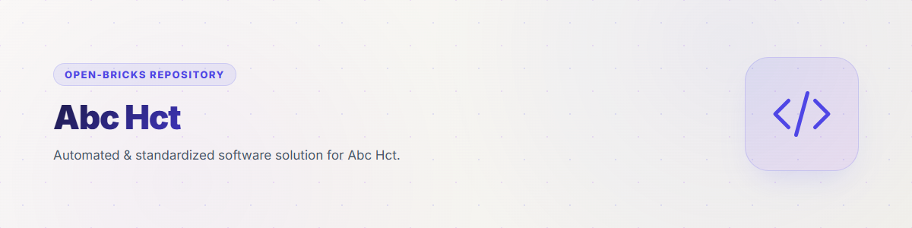
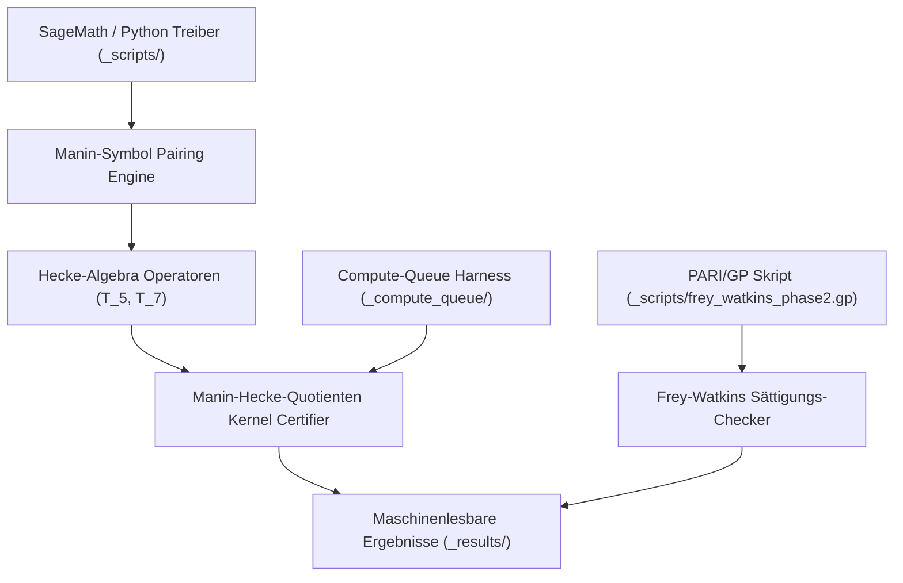
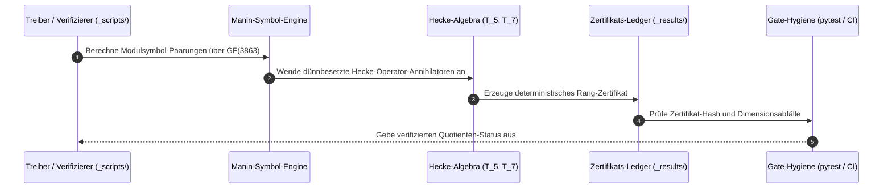

# abc-hct



[](README.md)
[](README_de.md)
[](https://github.com/research-line/abc-hct/actions/workflows/abc-hct-hygiene.yml)
[](tests/)
[](pyproject.toml)
[](pyproject.toml)
[](#)
[](#)
[](SECURITY.md)
[](SECURITY.md)
[](https://www.sagemath.org/)
[](https://pari.math.u-bordeaux.fr/)
[](llms.txt)
[](https://github.com/research-line)
[](https://github.com/open-bricks)
[](LICENSE)

Kuratiertes Forschungs-Repository für die Forschungslinie **HCT/abc** innerhalb der Organisation **research-line** und des Dachverbunds **open-bricks**.

> [!NOTE]
> Maschinenlesbare Kontext-Richtlinien, kanonische Suchbegriffe und Sicherheitsgrenzen für KI-Assistenten sind in [`llms.txt`](llms.txt) hinterlegt. Auffindbarkeitsdossier in [`MARKETING-LOG.txt`](MARKETING-LOG.txt). Drittanbieter-Lizenzen inventarisiert in [`THIRD_PARTY_LICENSES.md`](THIRD_PARTY_LICENSES.md). Sicherheitsgarantien und 48-Stunden-SLA sind in [`SECURITY.md`](SECURITY.md) definiert. Letzte Prüfung: **2026-09-10**.

---

<a id="quick-navigation"></a>
## 🧭 Schnellnavigation

| # | Abschnitt | Beschreibung |
|---|---|---|
| 1 | [Schnellreferenz](#quick-reference) | Kernmetadaten, Laufzeit-Stack & Betriebsgarantien |
| 2 | [Zentrale wissenschaftliche Ergebnisse](#key-scientific-findings) | Rechnerische Durchbrüche in der Hecke-Kurven-Arithmetik |
| 3 | [Systemarchitektur & Berechnungspipeline](#system-architecture--pipeline) | Modulare Berechnungs- und Zertifizierungsarchitektur |
| 4 | [Kuratierter Verifikations-Lebenszyklus](#curated-verification-lifecycle) | Deterministischer Ablauf der Beweisverifikation |
| 5 | [Kernfähigkeiten & Forschungsinvarianten](#core-capabilities--research-invariants) | 10 Architektur-, Datenschutz- & Governance-Garantien |
| 6 | [Ergebnis-Zuordnung & Paper-Referenzen](#evidence-mapping--paper-references) | Zitations-Ledger für Zenodo Paper A & Paper B |
| 7 | [Berechnungs-Meilensteine & Batches](#computational-milestones--batches) | Chronologische Meilensteine & H3a-Zertifikate |
| 8 | [Repository-Richtlinie & Gestufte Freigabe](#repository-policy--staged-disclosure) | Veröffentlichungsrichtlinie & Isolation von Beweisnotizen |
| 9 | [Geschwister-Forschungsnetzwerk & Ökosystem-Matrix](#sibling-research--ecosystem-matrix) | 16 organisationsübergreifende Partner-Repositories |
| 10 | [Auffindbarkeit & LLM-Kontext](#discovery--llm-context) | Maschinenlesbare Manifeste & KI-Indexierung |
| 11 | [Projektstruktur](#project-structure) | Repository-Aufbau und Skript-Taxonomie |
| 12 | [Tests & Verifikation](#testing--verification) | Pytest, Kompilierungsprüfung und Reproduktionsbefehle |
| 13 | [Drittanbieter-Lizenzen](#third-party-licenses) | Open-Source-Lizenzen für Python, SageMath und PARI/GP |
| 14 | [Sicherheit & Lizenz](#security--license) | Schwachstellen-SLA, Zero-Egress-Richtlinie & MIT-Lizenz |

---

<a id="quick-reference"></a>
## ⚡ Schnellreferenz

| Eigenschaft | Wert |
|---|---|
| **Kanonisches Repository** | `research-line/abc-hct` |
| **Dachorganisation** | `research-line` |
| **Dach-Ökosystem** | `open-bricks` |
| **Wissenschaftliche Fundierung** | Zenodo Paper A ([10.5281/zenodo.21916900](https://doi.org/10.5281/zenodo.21916900)) & Paper B |
| **Mathematik-Stack** | Python 3.10-3.13, SageMath 10.x, PARI/GP 2.15 |
| **Ausführungsgrenzen** | 100% Offline, Local-First, Zero-Egress, Nicht-Privilegiert |
| **Ergebnis-Ledger** | 120+ Kuratierte Zertifikate (`_results/`) |
| **Sicherheits-SLA** | 48h Eingangsbestätigung / 5-Werktage-Triage |
| **Lizenz** | MIT-Lizenz |

---

<a id="key-scientific-findings"></a>
## 🔬 Zentrale wissenschaftliche Ergebnisse

- **Magma-freier Manin-Hecke-Quotient (Basket Kill)**: Modulsymbol-Paarungen in Open-Source-SageMath/Python über $\text{GF}(3863)$ haben die abgebildeten Korb-Stufen `60168`, `80224`, `120336` und `240672` sowohl im `raw`- als auch im `anc`-Modus ohne proprietäre Software vollständig eliminiert.
- **H3a Residuen-Linien-Zeugen (RC3c)**: Deterministische Zeugen pro Stufe, Cusp-Fan-Rangketten und Präfixprofile über alle 4 Korb-Stufen verifiziert.
- **M-DET Block-Rang & Drop-Primzahlen**: Verifizierte Rangabfall-Zertifikate für die Stufen `60168` und `240672` zur Dokumentation nicht-trivialer Kernelstrukturen.
- **R1 Treues-AL $\mathbb{Q}_B$-Schur-Zertifikat**: Automatisiertes Feld-Check-Zertifikat für Stufe `80224/raw` bestätigt Charakter-Orthogonalität.
- **Frey-Watkins-Sättigungsdynamik**: Empirische Analyse von 15 klassischen Frey-Tripeln widerlegt naive universelle Schranken und stützt qualitativ-konditionale Schranken $\rho \ge (q-1)+c$.

---

<a id="system-architecture--pipeline"></a>
## 📐 Systemarchitektur & Berechnungspipeline



---

<a id="curated-verification-lifecycle"></a>
## 🔄 Kuratierter Verifikations-Lebenszyklus



---

<a id="core-capabilities--research-invariants"></a>
## 🛡️ Kernfähigkeiten & Forschungsinvarianten

`abc-hct` setzt zehn strikte architektonische, wissenschaftliche und Governance-Invarianten über alle Berechnungsmodule, Zertifikate und Test-Gates hinweg durch:

| Invarianten-ID | Garantiename | Architektonische & Betriebliche Beschreibung |
|---|---|---|
| **`INV-DET-01`** | **Deterministische algebraische Verifikation** | Sämtliche Hecke-Operator-Anwendungen, Modulsymbol-Paarungen über $\text{GF}(3863)$ und Kernel-Rangberechnungen sind strikt deterministisch und ohne stochastische Varianz reproduzierbar. |
| **`INV-ZE-02`** | **100% Offline- & Zero-Egress-Datenschutz** | Alle Berechnungen, Verifikationsskripte und Testrunner laufen vollständig offline ohne externe Netzwerkaufrufe oder Telemetrie-Exfiltration. |
| **`INV-CUR-03`** | **Kuratierte Evidenz & Nicht-Verschmutzung** | Strikte Trennung zwischen kuratierten publikationsreifen Reproduktions-Harnesses und internen Beweisnotizen; unkuratierte Notizen und Roh-Snapshots bleiben isoliert. |
| **`INV-CERT-04`** | **Maschinenlesbarer Zertifikats-Ledger** | Jedes Berechnungsergebnis wird als maschinenlesbares JSON/Text-Zertifikat unter `_results/` mit überprüfbaren Prüfsummen und exakter Skriptzuordnung persistiert. |
| **`INV-ENV-05`** | **Plattformübergreifende Mathematik-Isolation** | Python 3.10-3.13 Harness mit expliziten Abhängigkeiten zu SageMath 10.x und PARI/GP 2.15, begrenzter Queue-Ausführung und sauberer Fallback-Behandlung. |
| **`INV-MSTAR-06`** | **Magma-freie Modulsymbol-Engine** | Manin-Hecke-Quotientenberechnungen erfolgen über eigenständige Open-Source-Algorithmen in SageMath/Python ohne Abhängigkeit von proprietärem Magma. |
| **`INV-SEC-07`** | **Local-First Sandboxing & Nicht-Privilegierung** | Compute-Queue-Skripte und Pytest-Runner laufen ausschließlich im unprivilegierten Benutzermodus ohne Systemerhöhung oder externe Dateiänderungen. |
| **`INV-LIC-08`** | **Permissive Open-Science-Lizenzierung** | Sämtlicher Quellcode und Reproduktionsskripte unterliegen der permissiven MIT-Lizenz, vollständig kompatibel mit Open-Science-Richtlinien und Zenodo-Archivierung. |
| **`INV-DOC-09`** | **Zweisprachige & LLM-Bereite Parität** | 100%ige strukturelle und Anker-Parität zwischen `README.md` und `README_de.md`, ergänzt durch maschinenlesbare Architekturmanifeste in `llms.txt`. |
| **`INV-SLA-10`** | **48h Sicherheits-SLA & 5-Werktage-Triage** | Verbindliche Zusage zur Eingangsbestätigung von Sicherheitsmeldungen innerhalb von 48 Stunden und formaler Risikotriage innerhalb von 5 Werktagen via `security@open-bricks.org` und GitHub Advisories. |

---

<a id="evidence-mapping--paper-references"></a>
## 📊 Ergebnis-Zuordnung & Paper-Referenzen

Jede nachfolgende Ergebniskategorie wird in mindestens einem der begleitenden wissenschaftlichen Manuskripte zitiert. `DOI` bezeichnet die Zenodo-Konzept-DOI (verweist stets auf die aktuellste Fassung); `Paper`/`Referenz` nennt das Manuskript und exakte Dateinamen.

| Ergebniskategorie | Stufen / Umfang | Reproduktionsskript(e) | Ergebnisdateien (`_results/`) | Zitiert in |
|---|---|---|---|---|
| Magma-freier Manin-Hecke-Quotient (Basket Kill) | `60168, 80224, 120336, 240672` (`raw`+`anc`) über `GF(3863)` | `_scripts/mstar_nomagma_*.py` | `mstar_nomagma_*` (127 Dateien) | Paper A "Global Congruence Routes"/"Hecke Diagnostics"; Paper B `mstar_nomagma_result_audit_2026-05-12.md`, `mstar_nomagma_rc3d_rowhash_60168_raw*_2026-05-12.md` |
| H3a Residuen-Linien-Zeugen (RC3c) | alle 4 Stufen, `raw`+`anc` | `_scripts/mstar_h3a_*.py` | `mstar_h3a_*` (Zeugen pro Stufe, Cusp-Fan-Rangketten, Präfixprofile) | Paper A "The bridge search" (Table 1, `raw`/`anc` Stufen-Ledger); `REPRODUCIBILITY_H3A_2026-05-17.md` |
| M-DET Block-Rang / Rangabfall-Primzahlen | `60168`, `240672` | `_scripts/mdet3_block_rank_60168.py` | `mdet3_block_rank_60168_2026-06-14.*`, `mdet_240672_rank_drop_primes_2026-06-13.*` | Paper B (exakte Dateinamen zitiert) |
| R1 Treues-AL Q_B-Schur-Zertifikat | `80224/raw` | Compute-Queue-Job `r1_faithful_al_80224_raw_2026-06-14` + `r1_faithful_al_80224_raw_field_check_2026-06-27.py` | `r1_faithful_al_80224_raw_2026-06-14.*`, `r1_faithful_al_80224_raw_field_check_2026-06-27.*` | Paper B (exakter Dateiname zitiert; Feld-Check ergänzt 2026-08-17) |
| Selbstmittelungs-Diagnostik | Quality-Tail, dyadische Buckets | `_scripts/abc_quality_self_averaging_probe*.py` | `abc_quality_self_averaging_probe_2026-06-14.*` | Paper A "Self-averaging diagnostic" (`subsec:self_averaging`) |
| Frey-Watkins-Sättigung (Phase 1-3b, h_delta) | 15 klassische Frey-Tripel + 60-Punkte Sage-Stichprobe | `_scripts/frey_watkins_phase2.gp`, `_scripts/frey_watkins_phase2.py`, `_scripts/frey_watkins_phase3.py`, `_scripts/frey_faltings_sandwich_phase3b.py` | `frey_watkins_saturation_phase*`, `frey_faltings_sandwich_phase3b_2026-05-17.*` | Paper A (naive-FWS-falsified / quality-conditional-FWS-c) |
| CX2/CX3 Codex-Testempfehlungen | de-Smit-Champion-Stichprobe (n=230-240) | `_scripts/cx2_cx3_codex_tests.py` | `cx2_cx3_codex_tests_2026-06-11.*` | Negativkontrollen der Routen-Audits |

### Wissenschaftliche Publikationen

| Paper | DOI (Konzept) | Status |
|---|---|---|
| **Paper A** -- "From Landscape to Atlas: Multi-Route Cartography of an Ongoing Expedition Toward the *abc* Conjecture" | [10.5281/zenodo.21916900](https://doi.org/10.5281/zenodo.21916900) | Live und versioniert auf Zenodo |
| **Paper B** -- "Beneath the *abc* Landscape: Hecke Quotients and the HCT Route" | Demnächst | Entwurf, in Vorbereitung |

---

<a id="computational-milestones--batches"></a>
## 📅 Berechnungs-Meilensteine & Batches

- **Aktueller Berechnungsmeilenstein**: Der Magma-freie Sage/Python-Manin-Hecke-Quotient über $\text{GF}(3863)$ hat den abgebildeten Korb `60168/80224/120336/240672` im `raw`- und `anc`-Modus eliminiert. Die verbleibende Arbeit konzentriert sich auf theoretische Einbettung, Rang-Zertifizierung und einheitlichen FAQS/M*-Transfer.
- **H3a-Reproduzierbarkeits-Batch (`2026-05-17`)**: Reproduktionsskripte und maschinenlesbare Zertifikate unter `_scripts/` und `_results/` hinterlegt. Enthält das Standardzertifikat für `240672/raw` ($T_5$ belässt Dimension 1, $T_7$ annulliert die letzte Linie).
- **Exploratorischer Frey-Watkins-Batch (`2026-05-17`)**: Phase-1/Phase-2-Sättigungsergebnisse unter `_results/`. `_scripts/frey_watkins_phase2.gp` reproduziert die PARI/GP Phase-2-Berechnung für 15 klassische Frey-Tripel.

---

<a id="repository-policy--staged-disclosure"></a>
## 📜 Repository-Richtlinie & Gestufte Freigabe

- **Öffentlich seit 2026-08-18** (DOI-/Public-Release-Gate erreicht: Paper A live seit 2026-08-13, DOI [10.5281/zenodo.21916900](https://doi.org/10.5281/zenodo.21916900)).
- GitHub empfängt Berechnungsskripte und reproduzierbare Ergebnisse, keine internen Beweisnotizen.
- `BEWEISNOTIZ*`, `_proof-notes/`, Handoffs, rohe Agenten-Transkripte, Zugangsdaten oder Beweis-Scratch werden standardmäßig nicht committet.
- Interne Steuer-/Zustandsdateien wie `TODO.md`, `GAPS.md`, `AKTIONSPLAN.md`, `MEMORY.md`, `IDEENSPEICHER*.md`, lokale Quell-Caches und rohe `_data/`-Snapshots bleiben lokal.
- Interne Beweisnotizen werden erst nach Journal-Publikation und expliziter Freigabe publikationsfähig.
- Exploratorische Ergebnisnotizen werden nur zusammen mit dem von ihnen zitierten Reproduktionsskript freigegeben.
- Öffentliche Releases enthalten ausschließlich kuratierte Paper-Dateien, Reproduktionsskripte, ausgewählte Ergebnisse und einen sauberen Statushinweis.

---

<a id="sibling-research--ecosystem-matrix"></a>
## 🌐 Geschwister-Forschungsnetzwerk & Ökosystem-Matrix

`abc-hct` kooperiert innerhalb des **open-bricks** Forschungs- und Softwarenetzwerks:

| Repository | Organisation | Fokus & Wissenschaftliche Domäne | Sprache / Stack |
|---|---|---|---|
| **functional-stability-theory** | `research-line` | Funktionale Stabilitätstheorie Kern-Framework & Kontraktformen | Python / LaTeX |
| **fst-nash** | `research-line` | Algorithmische Spieltheorie und evolutionäre Nash-Gleichgewichtsstabilität | Python / SageMath |
| **economic-sanctions-coercive-diplomacy** | `research-line` | Formale quantitative Analyse wirtschaftlicher Sanktionen & Diplomatie | Python / LaTeX |
| **prompt-archaeology-casestudy2** | `research-line` | Prompt-Archäologie & LLM-Reasoning-Trajektorien-Provenienz | Python |
| **connes-cvs** | `research-line` | Connes-Spurformel & globale Feldverteilungen | Python / SageMath |
| **direct-beam** | `research-line` | Optische Strahlungs- & Beugungsmuster-Modellierung | Python / NumPy |
| **rh-even-dominance** | `research-line` | Riemannsche Vermutung Even-Dominanz & spektrale Schranken | Python / SageMath |
| **CultureEvolution** | `entertain-and-more` | Kulturelle Evolutionsmodelle & 4X-Zivilisationsspiel | Luau / Rojo |
| **DevCenter** | `dev-bricks` | Entwickler-Arbeitsbereich & Projektorchestrierung | TypeScript / Electron |
| **CodeBox** | `dev-bricks` | Mehrsprachige Code-Ausführung & Sandboxing | Rust / TypeScript |
| **automation-master** | `dev-bricks` | Multi-Agenten-Pipeline-Orchestrierung | Python |
| **cleaner-tree** | `file-bricks` | Lokale Dateisystem-Wartung & Deduplizierung | Python / PySide6 |
| **SoftwareCenter** | `file-bricks` | Desktop-Paketverwaltung & Software-Katalog | Python / PySide6 |
| **USR_pic2pic** | `doc-bricks` | Nicht-privilegierte lokale Stapel-Bildkonvertierung | Python / Tkinter |
| **ellmos-installer** | `ellmos-ai` | Nicht-erhöhte Dual-Gate-Installer-Engine | Python |
| **open-bricks** | `open-bricks` | Dachplattform für offene modulare Software- & Forschungsbausteine | Python / Markdown |

---

<a id="discovery--llm-context"></a>
## 🔍 Auffindbarkeit & LLM-Kontext

`abc-hct` stellt strukturierte, maschinenlesbare Spezifikationen bereit, damit autonome Agenten und Wissenschaftler die Architektur ohne Token-Overhead erfassen können:

- **[`llms.txt`](llms.txt)**: Schneller LLM-Index mit Modulgrenzen, Invarianten, Test-Gates und Schnittstellen.
- **[`MARKETING-LOG.txt`](MARKETING-LOG.txt)**: Auffindbarkeitsdossier mit Nutzenversprechen, Zielgruppen-Personas, Suchbegriffen und strategischer Roadmap.
- **[`THIRD_PARTY_LICENSES.md`](THIRD_PARTY_LICENSES.md)**: Vollständiges Open-Source-Lizenzinventar für mathematische Engines und Entwickler-Tools.

---

<a id="project-structure"></a>
## 🛠️ Projektstruktur

```
abc-hct/
├── .github/workflows/          # GitHub Actions CI-Workflow (abc-hct-hygiene.yml)
├── _compute_queue/             # Berechnungs-Queue, Runner-Harnesses & lokale Protokolle
├── _results/                   # 120+ Kuratierte maschinenlesbare Resultatzertifikate
├── _scripts/                   # SageMath, PARI/GP & Python Reproduktionsskripte
├── assets/                     # Repository-Branding-Banner
├── tests/                      # Automatisierte Metadaten-, Kontrakt- & Syntax-Testsuite
│   ├── test_metadata.py        # Metadaten-, Navigationsparitäts- & Invariantenkontrakte
│   ├── test_policy.py          # Gitignore-, Pfadleak- & Grenzrichtlinientests
│   └── test_scripts_compilation.py # Python-Bytecode-Kompilierungstests
├── pyproject.toml              # PEP 621 Metadaten, Toolchain & Pytest-Konfiguration
├── CHANGELOG.md                # Semantisches Versions- und Änderungsprotokoll
├── MARKETING-LOG.txt           # Discoverability-, SEO- & Persona-Audit
├── THIRD_PARTY_LICENSES.md     # Lizenzinventar mathematischer Engines & Toolchains
├── SECURITY.md                 # Zweisprachige Sicherheitsrichtlinie & 48h-SLA
├── REPRODUCIBILITY_H3A_2026-05-17.md # Übersicht zur H3a-Reproduzierbarkeit
├── LICENSE                     # MIT-Lizenz
└── llms.txt                    # Maschinenlesbarer Kontext-Index
```

---

<a id="testing--verification"></a>
## 🧪 Tests & Verifikation

`abc-hct` unterhält eine umfassende automatisierte Testpipeline zur Verifikation von Dokumentationskontrakten, Syntaxhygiene und Sicherheitsrichtlinien:

```bash
# Vollständige automatisierte Pytest-Suite ausführen (24 Tests)
pytest -ra -v

# Python-Bytecode-Kompilierung über alle Skripte und Tests prüfen
python -m compileall _scripts tests

# Ruff Code-Hygiene-Prüfung ausführen
ruff check .

# Frey-Watkins Phase-2 Reproduktionsprüfung ausführen (PARI/GP)
gp _scripts/frey_watkins_phase2.gp

# Manin-Hecke-Quotienten-Rangzertifikate verifizieren
python _scripts/mstar_h3a_rc3c_witness_verify_rank.py
```

---

<a id="third-party-licenses"></a>
## 📜 Drittanbieter-Lizenzen

`abc-hct` stützt sich ausschließlich auf permissive und quelloffene mathematische Systeme und Testwerkzeuge:
- **Python-Standardbibliothek**: Python Software Foundation License (PSFL-2.0)
- **SageMath**: GNU General Public License Version 2 oder neuer (GPL-2.0+)
- **PARI/GP**: GNU General Public License Version 2 oder neuer (GPL-2.0+)
- **pytest & Ruff**: MIT-Lizenz / Apache-Lizenz 2.0

Sämtliche Urheberrechte und Lizenztexte sind in [`THIRD_PARTY_LICENSES.md`](THIRD_PARTY_LICENSES.md) dokumentiert.

---

<a id="security--license"></a>
## 🔒 Sicherheit & Lizenz

Sicherheitsmeldungen, Richtlinien zur Offenlegung von Schwachstellen und Sicherheitsinvarianten sind in [`SECURITY.md`](SECURITY.md) beschrieben.
`abc-hct` garantiert:
- **48-Stunden Reaktions-SLA**: Erstbestätigung sicherheitsrelevanter Meldungen innerhalb von 48 Stunden.
- **5-Werktage Triage-Verpflichtung**: Strukturierte Risikobewertung und Behebungs-Roadmap innerhalb von 5 Werktagen.
- **Zero-Egress-Datenschutz**: 100% lokale Offline-Berechnung ohne externe Datenübertragung.

Dieses Projekt steht unter der **MIT-Lizenz** — siehe [`LICENSE`](LICENSE) für weitere Details.
