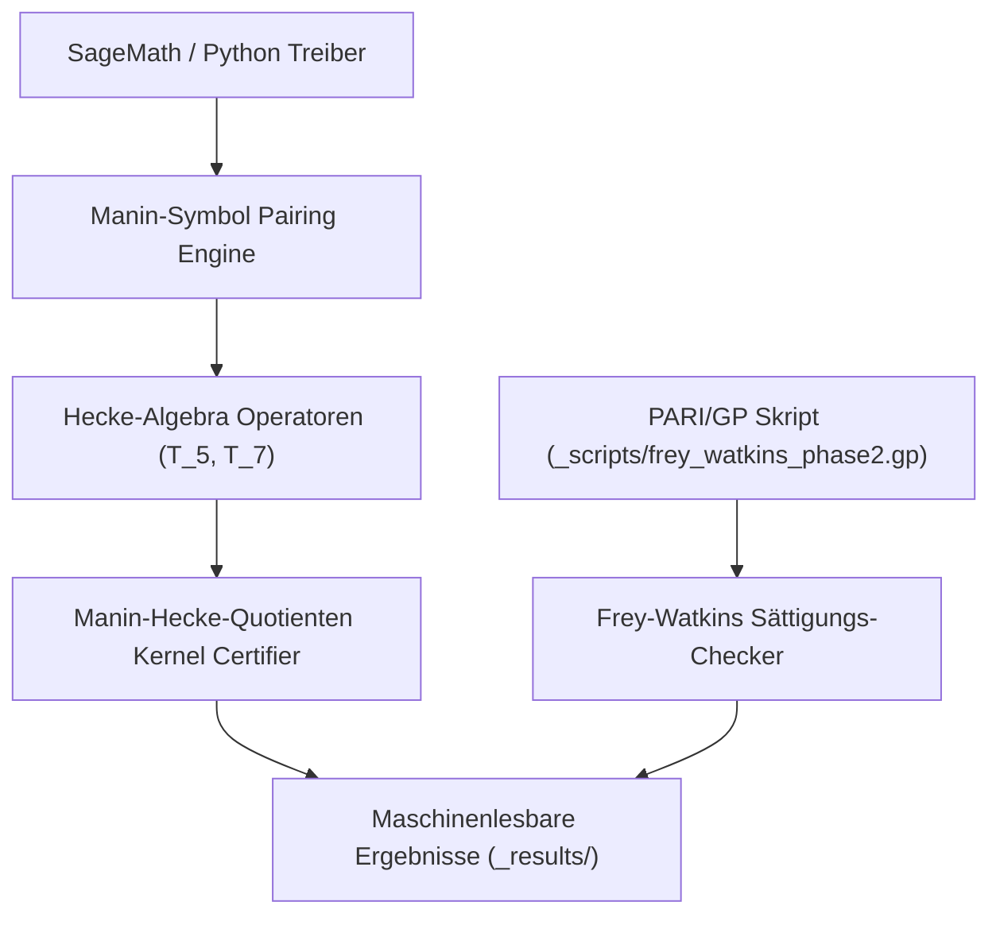

# abc-hct

Privates Arbeits-Repository für die Forschungslinie HCT/abc.

> [!NOTE]
> Maschinenlesbare Kontext-Richtlinien, kanonische Suchbegriffe und Sicherheitsgrenzen für KI-Assistenten sind in [llms.txt](llms.txt) hinterlegt.

## Schnellnavigation

| Ressource | Beschreibung |
|---|---|
| [llms.txt](llms.txt) | LLM-Kontextrichtlinien, Suchphrasen & Sicherheitsgrenzen |
| [README.md](README.md) | Englische Dokumentationsfassung / English primary documentation |
| [CHANGELOG.md](CHANGELOG.md) | Release-Historie und Wartungsprotokoll |
| [REPRODUCIBILITY_H3A_2026-05-17.md](REPRODUCIBILITY_H3A_2026-05-17.md) | Übersicht des H3a-Reproduzierbarkeits-Batches und der Zertifikate |

## Systemarchitektur & Berechnungs-Pipeline

## Geschwisterforschungs- & Ökosystem-Matrix

| Repository | Fokus & Domäne | Sprache / Stack | Status |
|---|---|---|---|
| [functional-stability-theory](https://github.com/research-line/functional-stability-theory) | Funktionale Stabilitätstheorie Kern-Framework & Kontraktformen | Python / LaTeX | Aktiv |
| [fst-nash](https://github.com/research-line/fst-nash) | Algorithmische Spieltheorie und evolutionäre Nash-Gleichgewichtsstabilität | Python / SageMath | Aktiv |
| [economic-sanctions-coercive-diplomacy](https://github.com/research-line/economic-sanctions-coercive-diplomacy) | Formale quantitative Analyse wirtschaftlicher Sanktionen & Diplomatie | Python / LaTeX | Aktiv |
| [prompt-archaeology-casestudy2](https://github.com/research-line/prompt-archaeology-casestudy2) | Prompt-Archäologie & LLM-Reasoning-Trajektorien-Provenienz | Python | Aktiv |
| [CultureEvolution](https://github.com/research-line/CultureEvolution) | Kulturelle Evolutionsmodelle & Multi-Agenten-Populationsdynamik | Python / Jupyter | Aktiv |
| [connes-cvs](https://github.com/research-line/connes-cvs) | Connes-Spurformel & globale Feldverteilungen | Python / SageMath | Aktiv |
| [direct-beam](https://github.com/research-line/direct-beam) | Optische Strahlungs- & Beugungsmuster-Modellierung | Python / NumPy | Aktiv |
| [DevCenter](https://github.com/dev-bricks/DevCenter) | Entwickler-Arbeitsbereich & Projektorchestrierung | TypeScript / Electron | Aktiv |
| [CodeBox](https://github.com/dev-bricks/CodeBox) | Mehrsprachige Code-Ausführung & Sandboxing | Rust / TypeScript | Aktiv |

## Aktueller Umfang

- Zweisprachige abc/HCT Entwürfe,
- Reproduzierbare Skripte für den Magma-freien Manin-Hecke-Quotientenpfad,
- Kuratierte maschinenlesbare Ergebnisartefakte zur Verifikation,
- Publikationsreife Ergänzungen nach Kuration.

## Repository-Richtlinien

- Repository bis zum Erreichen des entsprechenden DOI-/Public-Release-Gates privat halten.
- GitHub empfängt Berechnungsskripte und reproduzierbare Ergebnisse, keine internen Beweisnotizen.
- `BEWEISNOTIZ*`, `_proof-notes/`, Handoffs, rohe Agenten-Transkripte, Zugangsdaten oder Beweis-Scratch nicht committen.
- Interne Steuer-/Zustandsdateien wie `TODO.md`, `GAPS.md`, `AKTIONSPLAN.md`, `MEMORY.md`, `IDEENSPEICHER*.md`, lokale Quell-Caches und rohe `_data/`-Snapshots bleiben standardmäßig lokal.
- Interne Beweisnotizen werden erst nach Journal-Publikation und expliziter Freigabe publikationsfähig.
- Exploratorische Ergebnisnotizen werden nur zusammen mit dem von ihnen zitierten Reproduktionsskript freigegeben.
- Öffentliche Releases sollten nur kuratierte Paper-Dateien, Reproduktionsskripte, ausgewählte Ergebnisse und einen sauberen Statushinweis enthalten.

## Repository-Hygiene

- GitHub Actions führt bei Pushes und Pull Requests `abc-hct hygiene` aus.
- Der Workflow prüft die Python-Syntax für `_scripts/` und `_compute_queue/scripts/`.
- Er führt die automatisierte Pytest-Testsuite (`test_policy`, `test_metadata`, `test_scripts_compilation`) aus.
- Er stellt sicher, dass `.gitignore` weiterhin Beweisnotizen, Handoffs, lokalen Status, rohe Daten-Snapshots und transiente Logs ausschließt.
- Lange Berechnungen verbleiben außerhalb von GitHub Actions in der lokalen Compute-Queue oder auf dedizierten Remote-Compute-Hosts.

## Primärer lokaler Arbeitsbaum

Dieses Repository wird aus dem lokalen abc/HCT-Projekt-Root kuratiert; host-spezifische absolute Pfade sind bewusst von der Versionskontrolle ausgeschlossen.

## Aktueller meilensteinartiger Rechenstand

Der Magma-freie Sage/Python Manin-Hecke-Quotient über `GF(3863)` hat den gemappten Basket `60168/80224/120336/240672` sowohl im `raw`- als auch im `anc`-Modus terminiert. Verbleibende Arbeiten betreffen theoretisches Embedding, Rang-Zertifizierung und einheitlichen FAQS/M*-Transfer.

## Neuester kuratierter Batch

- `2026-05-17`: H3a/Magma-freie Reproduktionsskripte und maschinenlesbare Zertifikate wurden unter `_scripts/` und `_results/` ergänzt.
- Der Batch beinhaltet das `240672/raw` Standard-Zertifikat: `T_5` belässt die Quotientendimension auf `1`, danach eliminiert `T_7` die finale Linie.
- Unabhängige Verifikationsartefakte mit hohem Rang werden nur aufgenommen, wenn deren Ergebnisdateien existieren.

## Frey-Watkins Exploratory Batch

- `2026-05-17`: Phase-1/Phase-2 Frey-Watkins Sättigungsergebnisse wurden unter `_results/` hinterlegt.
- `_scripts/frey_watkins_phase2.gp` reproduziert die PARI/GP Phase-2 Berechnung für 15 klassische Frey-Tripel.
- `_scripts/frey_watkins_phase2.py` ist eine Sage/Python Hilfsklasse mit identischer Tripel-Liste.
- Hauptergebnis: Naives universelles `log m / log N >= 1` wird am Sample falsifiziert, während das qualitäts-konditionierte Muster `rho >= (q-1)+c` empirisch gestützt bleibt.

## LLM-Kontext

- [LLM-Kontext](llms.txt) enthält kanonische Links, Schnittstellen, Suchbegriffe und Sicherheitsgrenzen für KI-Codierungsassistenten.
