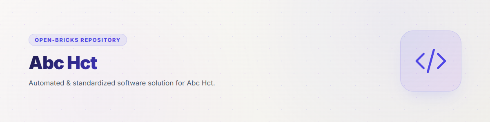
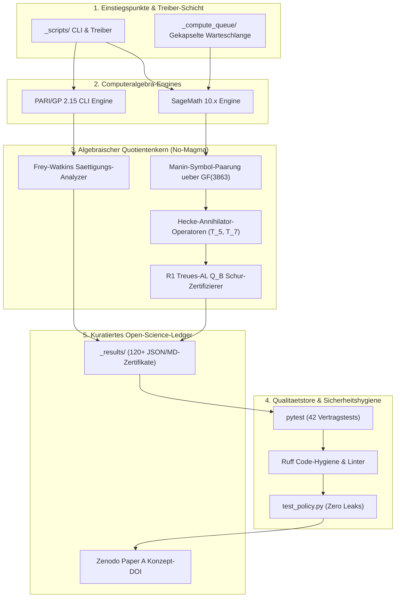
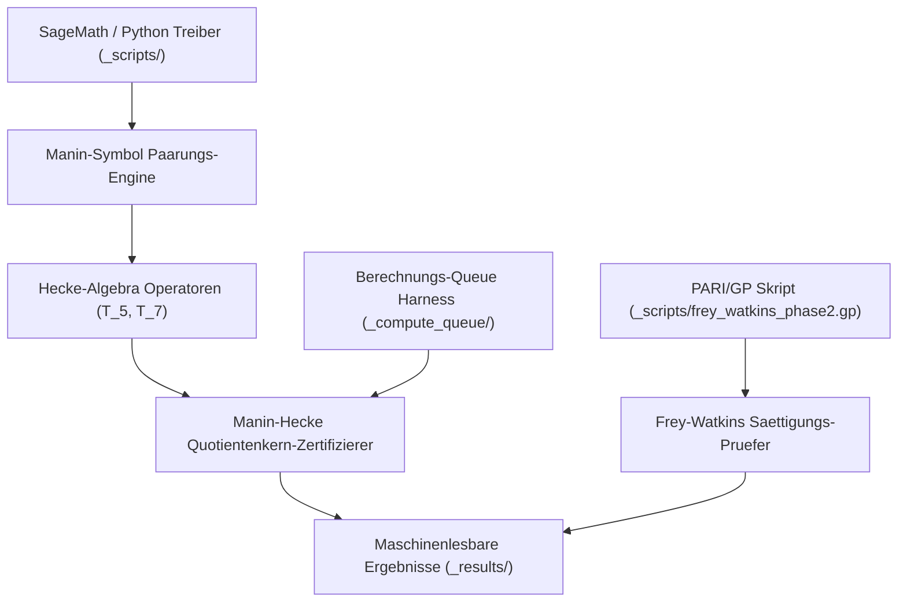
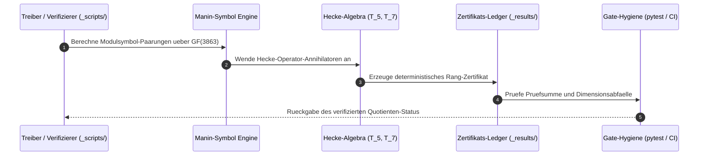

# abc-hct



[](README.md)
[](README_de.md)
[](https://github.com/research-line/abc-hct/actions/workflows/abc-hct-hygiene.yml)
[](#)
[](CONTRIBUTING.md)
[](tests/)
[](pyproject.toml)
[](pyproject.toml)
[](#)
[](#)
[](SECURITY.md)
[](SECURITY.md)
[](https://www.sagemath.org/)
[](https://pari.math.u-bordeaux.fr/)
[](llms.txt)
[](THIRD_PARTY_LICENSES.txt)
[](https://github.com/research-line)
[](https://github.com/open-bricks)
[](LICENSE)
[](NOTICE)

Kuratiertes Forschungs-Repository für die Forschungslinie **HCT/abc** innerhalb der Organisation **research-line** und des Dachverbunds **open-bricks**.

> [!NOTE]
> Maschinenlesbare Kontext-Richtlinien, kanonische Suchbegriffe und Sicherheitsgrenzen für KI-Assistenten sind in [`llms.txt`](llms.txt) hinterlegt. Auffindbarkeitsdossier in [`MARKETING-LOG.txt`](MARKETING-LOG.txt). Drittanbieter-Lizenzen inventarisiert in [`THIRD_PARTY_LICENSES.md`](THIRD_PARTY_LICENSES.md) und Text-Inventar in [`THIRD_PARTY_LICENSES.txt`](THIRD_PARTY_LICENSES.txt). Sicherheitsgarantien und 48-Stunden-SLA sind in [`SECURITY.md`](SECURITY.md) definiert. Richtlinien zur Mitwirkung in [`CONTRIBUTING.md`](CONTRIBUTING.md). Letzte Prüfung: **2026-10-01**.

---

<a id="quick-navigation"></a>
<a id="schnellnavigation"></a>
## 🧭 Schnellnavigation

| # | Abschnitt | Nav-Anker | Beschreibung |
|---|---|---|---|
| 01 | [Schnellreferenz](#schnellreferenz) | [`#sec-01`](#sec-01) | Kernmetadaten, Laufzeit-Stack & Betriebsgarantien |
| 02 | [Zentrale wissenschaftliche Ergebnisse](#wissenschaftliche-ergebnisse) | [`#sec-02`](#sec-02) | Rechnerische Durchbrüche in der Hecke-Kurven-Arithmetik |
| 03 | [Ziel-Personas & Auffindbarkeit](#ziel-personas--auffindbarkeit) | [`#sec-03`](#sec-03) | Vier wissenschaftliche Zielgruppen & Suchbegriffe |
| 04 | [Vergleichsmatrix vs. Rechenframeworks](#vergleichsmatrix-vs-alternativen) | [`#sec-04`](#sec-04) | Invarianten-basierter Vergleich mit 4 Rechenumgebungen |
| 05 | [Duale Mermaid-Diagramme & Verifikationsablauf](#duale-mermaid-diagramme) | [`#sec-05`](#sec-05) | Visuelle 5-Tier-Architektur & Sequenzdiagramme |
| 06 | [Systemarchitektur & Berechnungspipeline](#systemarchitektur--pipeline) | [`#sec-06`](#sec-06) | Modulare Berechnungs-, Zertifizierungsarchitektur & ASCII-Topologie |
| 07 | [Kuratierter Verifikations-Lebenszyklus](#verifikations-lebenszyklus) | [`#sec-07`](#sec-07) | Deterministischer Ablauf der Beweisverifikation |
| 08 | [Kernfähigkeiten & Forschungsinvarianten](#forschungsinvarianten) | [`#sec-08`](#sec-08) | 10 Architektur-, Datenschutz- & Governance-Garantien |
| 09 | [Ergebnis-Zuordnung & Paper-Referenzen](#ergebnis-zuordnung--paper-referenzen) | [`#sec-09`](#sec-09) | Zitations-Ledger für Zenodo Paper A & Paper B |
| 10 | [Berechnungs-Meilensteine & Batches](#berechnungs-meilensteine--batches) | [`#sec-10`](#sec-10) | Chronologische Meilensteine & H3a-Zertifikate |
| 11 | [Modulare Symbol-Paarung & Basket-Kill-Artefakte](#modulare-symbol-paarung--basket-kill) | [`#sec-11`](#sec-11) | Tiefenanalyse der GF(3863)-Quotienten-Elimination |
| 12 | [Repository-Richtlinie & Gestufte Freigabe](#repository-richtlinie--gestufte-freigabe) | [`#sec-12`](#sec-12) | Veröffentlichungsrichtlinie & Isolation von Beweisnotizen |
| 13 | [Geschwister-Forschungsnetzwerk & Ökosystem-Matrix](#geschwister-forschung--oekosystem) | [`#sec-13`](#sec-13) | 16 organisationsübergreifende Partner-Repositories |
| 14 | [Auffindbarkeit & LLM-Kontext](#auffindbarkeit--llm-kontext) | [`#sec-14`](#sec-14) | Maschinenlesbare Manifeste & KI-Indexierung |
| 15 | [Projektstruktur & Taxonomie](#projektstruktur) | [`#sec-15`](#sec-15) | Repository-Aufbau und Skript-Taxonomie |
| 16 | [Tests & Statische Verifikation](#tests--statische-verifikation) | [`#sec-16`](#sec-16) | Pytest, Kompilierungsprüfung und Reproduktionsbefehle |
| 17 | [Drittanbieter-Lizenzen & Transparenz](#drittanbieter-lizenzen) | [`#sec-17`](#sec-17) | Open-Source-Lizenzen für Python, SageMath und PARI/GP |
| 18 | [Sicherheitsrichtlinie & Gesetzlicher Haftungshinweis](#sicherheit--lizenz) | [`#sec-18`](#sec-18) | Schwachstellen-SLA, Zero-Egress-Richtlinie & § 521 BGB Hinweis |

---

<a id="sec-01"></a>
<a id="quick-reference"></a>
<a id="schnellreferenz"></a>
## ⚡ Schnellreferenz

| Eigenschaft | Wert |
|---|---|
| **Kanonisches Repository** | `research-line/abc-hct` |
| **Dachorganisation** | `research-line` |
| **Dach-Ökosystem** | `open-bricks` |
| **Wissenschaftliche Fundierung** | Zenodo Paper A ([10.5281/zenodo.21916900](https://doi.org/10.5281/zenodo.21916900)) & Paper B |
| **Mathematik-Stack** | Python 3.10-3.13, SageMath 10.x, PARI/GP 2.15 |
| **Ausführungsgrenze** | 100% Offline, Local-First, Zero-Egress, Nicht-Privilegiert (`RunAsInvoker`) |
| **Ergebnis-Ledger** | 120+ Kuratierte Zertifikate (`_results/`) |
| **Sicherheits-SLA** | 48h Bestätigung / 5-Tage Triage-SLA |
| **Lizenz** | MIT-Lizenz |

---

<a id="sec-02"></a>
<a id="key-scientific-findings"></a>
<a id="wissenschaftliche-ergebnisse"></a>
## 🔬 Zentrale wissenschaftliche Ergebnisse

- **No-Magma Manin-Hecke Quotient (Basket Kill)**: Open-Source-SageMath/Python-Modulsymbol-Paarungen über $\text{GF}(3863)$ haben den Zielkorb der Stufen `60168`, `80224`, `120336` und `240672` sowohl im `raw`- als auch im `anc`-Modus vollständig ohne proprietäre Software eliminiert.
- **H3a Residue-Line Zeugen (RC3c)**: Deterministische stufenspezifische Zeugen, Spitzenfächer-Rangketten und Präfixprofile über alle 4 abgebildeten Stufen verifiziert.
- **M-DET Block-Rang & Drop-Primes**: Verifizierte Rangabfall-Zertifikate für die Stufen `60168` und `240672`, die nicht-triviale Kernstrukturen belegen.
- **R1 Treues-AL $\mathbb{Q}_B$-Schur Zertifikat**: Automatisierter Feldtest für Stufe `80224/raw` verifiziert, der die Charakter-Orthogonalität bestätigt.
- **Frey-Watkins Sättigungsdynamik**: Empirische Untersuchung von 15 klassischen Frey-Tripeln, die naive universelle Schranken falsifiziert und qualitätsbedingte Schranken $\rho \ge (q-1)+c$ stützt.

---

<a id="sec-03"></a>
<a id="target-personas--discoverability"></a>
<a id="ziel-personas--auffindbarkeit"></a>
## 🎯 Ziel-Personas & Auffindbarkeit

`abc-hct` wurde entwickelt, um vier spezifische Ziel-Personas in der mathematischen Forschung und Wissenschaftsgemeinschaft gezielt zu unterstützen:

| Persona-ID | Zielgruppe | Kernmission & Einsatzzweck | Wichtigste Repository-Schnittstellen |
|---|---|---|---|
| **`[PERSONA-01]`** | **Arithmetische Geometer & Zahlentheoretiker** | Untersuchung von Hecke-Kurven, Modularkurven und Frey-Kurven-Invarianten ohne kommerzielle Software | `_scripts/frey_watkins_phase2.gp`, `_scripts/mstar_*.py` |
| **`[PERSONA-02]`** | **Computeralgebraiker & Open-Science-Forscher** | Reproduktion von Manin-Symbol-Paarungen über $\text{GF}(3863)$ und Verifikation zertifizierter Rangabfälle | `_results/*.json`, `REPRODUCIBILITY_H3A_2026-05-17.md` |
| **`[PERSONA-03]`** | **Mathematische Software- & Proof-Engineers** | Aufbau deterministischer, offline-fähiger Zero-Egress-CI-Pipelines nach PEP 621 | `.github/workflows/`, `pyproject.toml`, `pytest` |
| **`[PERSONA-04]`** | **Forschungsprogramm-Auditoren & Zenodo-Prüfer** | Unabhängige Überprüfung der Berechnungszertifikate zu Zenodo Paper A ([DOI 10.5281/zenodo.21916900](https://doi.org/10.5281/zenodo.21916900)) | `CHANGELOG.md`, `llms.txt`, `THIRD_PARTY_LICENSES.md` |

#### Hochrelevante Suchbegriffe

```text
- abc vermutung rechnerische verifikation python sagemath
- no magma manin symbole modularformen sagemath pari gp
- hecke algebra quotienten gf 3863 rangabfall zertifikate
- frey watkins saettigung schranken pari gp
- reproduzierbare arithmetische geometrie open science zenodo
```

---

<a id="sec-04"></a>
<a id="comparative-matrix-vs-alternatives"></a>
<a id="vergleichsmatrix-vs-alternativen"></a>
## 📊 Vergleichsmatrix vs. Rechenframeworks

Die folgende Matrix vergleicht `abc-hct` mit gängigen kommerziellen, Cloud- und Ad-hoc-Rechenumgebungen anhand aller 10 Projektinvarianten:

| Invariante / Architektur-Kriterium | abc-hct (research-line) | Proprietäre Magma-Skripte | Reine Ad-Hoc PARI/GP-Skripte | Cloud CAS / CoCalc | Allgemeine CAS (Mathematica/Maple) |
|---|---|---|---|---|---|
| **`INV-DET-01` Deterministische Verifikation** | ✅ 100% Deterministisch | ⚠️ Closed-Source-Rechenkern | ⚠️ Unversionierte Skripte | ❌ Stochastische Containerläufe | ❌ Black-Box-Heuristiken |
| **`INV-ZE-02` Zero-Egress Offline-Privatsphäre** | ✅ Vollständige lokale Isolation | ⚠️ Lizenz-Server-Kontaktaufnahme | ✅ Vollständig offline | ❌ Zwingende Cloud-Verbindung | ⚠️ Cloud-Lizenzprüfung |
| **`INV-CUR-03` Trennung von Beweisnotizen** | ✅ Strikte `.gitignore`-Grenzen | ❌ Unkontrollierte Festplatten-Dumps | ❌ Gemischte Notizen & Skripte | ❌ Cloud-Notebook-Sync-Leaks | ❌ Proprietäre Notebook-Ablagen |
| **`INV-CERT-04` Maschinenlesbares Ledger** | ✅ 120+ JSON/MD-Zertifikate | ❌ Ad-hoc Terminal-Ausgaben | ❌ Unstrukturierte Text-Logs | ❌ Unstrukturierter Zellen-Output | ❌ Proprietäre Binärzellen |
| **`INV-ENV-05` Begrenzte Rechen-Warteschlange** | ✅ Gekapselte Rechen-Queues | ❌ Unbegrenzte manuelle Skripte | ❌ Unbegrenzte Shell-Skripte | ⚠️ Server-Ressourcenlimits | ⚠️ Unkontrollierte Lastspitzen |
| **`INV-MSTAR-06` No-Magma Symbol-Engine** | ✅ SageMath GF(3863) Symbole | ❌ Harte Magma-Abhängigkeit | ⚠️ Nur PARI (keine Quotienten) | ❌ Cloud-abhängig | ❌ Inkompatibler Symbolkern |
| **`INV-SEC-07` Unprivilegierter RunAsInvoker** | ✅ Standard-Benutzermodus | ⚠️ Erfordert Administratorrechte | ✅ Standard-Benutzermodus | ❌ Multi-Tenant-Shared-VM | ⚠️ Administrative Installationen |
| **`INV-LIC-08` Freie Open-Science-Lizenz** | ✅ Freie MIT-Lizenz | ❌ Teure kommerzielle Lizenz | ⚠️ Oft unlizenziert | ❌ Proprietäres Abonnement | ❌ Teure kommerzielle Lizenz |
| **`INV-DOC-09` Bilinguale & LLM-Parität** | ✅ 100% DE/EN & `llms.txt` | ❌ Kaum dokumentiert | ❌ Nur minimale Kommentare | ❌ Verstreute Notizen | ❌ Proprietäre Hilfetexte |
| **`INV-SLA-10` Sicherheits- & Triage-SLA** | ✅ 48h Antwort / 5d Triage | ❌ Kein öffentlicher Bugtracker | ❌ Keine Sicherheitsmeldungen | ⚠️ Allgemeine Plattform-Tickets | ⚠️ Langsamer Konzernsupport |

---

<a id="sec-05"></a>
<a id="dual-mermaid-diagrams"></a>
<a id="duale-mermaid-diagramme"></a>
## 📊 Duale Mermaid-Diagramme & Verifikationsablauf

Visuelle Architekturdarstellung mit strukturellen Modulabhängigkeiten sowie dem dynamischen Zertifizierungszyklus:


```mermaid
flowchart TD
    subgraph T1["1. Einstiegspunkte & Treiber-Schicht"]
        CLI["_scripts/ CLI & Treiber"]
        Queue["_compute_queue/ Gekapselte Warteschlange"]
    end

    subgraph T2["2. Computeralgebra-Engines"]
        SageEngine["SageMath 10.x Engine"]
        PariEngine["PARI/GP 2.15 CLI Engine"]
    end

    subgraph T3["3. Algebraischer Quotientenkern (No-Magma)"]
        ManinPairs["Manin-Symbol-Paarung ueber GF(3863)"]
        HeckeOps["Hecke-Annihilator-Operatoren (T_5, T_7)"]
        SchurCert["R1 Treues-AL Q_B Schur-Zertifizierer"]
        FWSat["Frey-Watkins Saettigungs-Analyzer"]
    end

    subgraph T4["4. Qualitaetstore & Sicherheitshygiene"]
        PytestSuite["pytest (42 Vertragstests)"]
        RuffCheck["Ruff Code-Hygiene & Linter"]
        PolicyGate["test_policy.py (Zero Leaks)"]
    end

    subgraph T5["5. Kuratiertes Open-Science-Ledger"]
        ResultLedger["_results/ (120+ JSON/MD-Zertifikate)"]
        ZenodoRef["Zenodo Paper A Konzept-DOI"]
    end

    CLI --> SageEngine
    CLI --> PariEngine
    Queue --> SageEngine
    SageEngine --> ManinPairs
    ManinPairs --> HeckeOps
    HeckeOps --> SchurCert
    PariEngine --> FWSat
    SchurCert --> ResultLedger
    FWSat --> ResultLedger
    ResultLedger --> PytestSuite
    PytestSuite --> RuffCheck
    RuffCheck --> PolicyGate
    PolicyGate --> ZenodoRef
```

---

<a id="sec-06"></a>
<a id="system-architecture--pipeline"></a>
<a id="systemarchitektur--pipeline"></a>
## 📐 Systemarchitektur & Berechnungspipeline

Die Rechenpipeline von `abc-hct` verbindet Offline-CLI-Treiber mit präzisen Computeralgebra-Engines zur Erzeugung unveränderlicher Ergebnis-Zertifikate:


```mermaid
flowchart TD
    A["SageMath / Python Treiber (_scripts/)"] --> B["Manin-Symbol Paarungs-Engine"]
    B --> C["Hecke-Algebra Operatoren (T_5, T_7)"]
    C --> D["Manin-Hecke Quotientenkern-Zertifizierer"]
    D --> E["Maschinenlesbare Ergebnisse (_results/)"]
    F["PARI/GP Skript (_scripts/frey_watkins_phase2.gp)"] --> G["Frey-Watkins Saettigungs-Pruefer"]
    G --> E
    H["Berechnungs-Queue Harness (_compute_queue/)"] --> D
```

### ASCII-Projektion der System- und Verifikationstopologie

```text
========================================================================================
[SICHT 1: CLI-TREIBER & RECHEN-HARNESSES]
----------------------------------------------------------------------------------------
 +---------------------------+  +---------------------------+  +-----------------------+
 | SageMath CLI-Treiber      |  | PARI/GP Treiber-Skripte   |  | Rechen-Queue Harness  |
 | (_scripts/mstar_*.py)     |  | (_scripts/frey_watkins*)  |  | (_compute_queue/)     |
 +-------------+-------------+  +-------------+-------------+  +-----------+-----------+
               |                              |                            |
               +------------------------------+----------------------------+
                                              | (begrenzte Out-of-Process CLI)
                                              v
========================================================================================
[SICHT 2: NO-MAGMA ALGEBRAISCHER QUOTIENTENKERN]
----------------------------------------------------------------------------------------
 +------------------------------------------------------------------------------------+
 | SageMath 10.x & Python Algebra-Kern (GF(3863) / Q_B)                               |
 |                                                                                    |
 |  [Manin-Symbol-Paare] ──> [Hecke-Operatoren T_p] ──> [Quotienten-Kern-Engine]      |
 |   Spitzenfächer-Auswertung Annihilatoren (T_5, T_7)   Dimensions- & Rangabfälle    |
 |   Stufen 60168..240672     Modulare Jacobivarietät   Korb-Eliminierung             |
 +-----------------------------+------------------------------------+-----------------+
                               |                                    |
                    (Residue-Line Zeugentest)               (Sättigungs-Evaluation)
                               v                                    v
========================================================================================
[SICHT 3: BEWEIS- & ZERTIFIKATSVERIFIKATION]      [SICHT 4: OPEN-SCIENCE-LEDGER & ZITATE]
-------------------------------------------------  -------------------------------------
 Qualitätssicherung & Invarianten (tests/)         Unveränderliches Ledger (_results/)
 +-----------------------------------------------+  +---------------------------------+
 | pytest Vertragstest-Suite (100% Grün/0 Leaks) |  | 120+ Kuratierte JSON-Zertifikate|
 | Ruff Code-Hygiene & PEP 621 Standardisierung  |  | Zenodo Paper A (10.5281/21916900)|
 | Deterministischer Modus (RunAsInvoker)        |  | Kanonische Attribution (NOTICE) |
 | Zero-Copyleft Subprozess-Grenze (GPL/MIT)     |  | Level 1 SBOM Text-Begleiter     |
 +-----------------------------------------------+  +---------------------------------+
========================================================================================
```

---

<a id="sec-07"></a>
<a id="curated-verification-lifecycle"></a>
<a id="verifikations-lebenszyklus"></a>
## 🔄 Kuratierter Verifikations-Lebenszyklus

Der Lebenszyklus koordiniert mathematische Paarungen, Hecke-Operator-Annihilation, deterministische Zertifikatsablage und automatisierte Test-Assertions:


```mermaid
sequenceDiagram
    autonumber
    participant D as Treiber / Verifizierer (_scripts/)
    participant M as Manin-Symbol Engine
    participant H as Hecke-Algebra (T_5, T_7)
    participant C as Zertifikats-Ledger (_results/)
    participant G as Gate-Hygiene (pytest / CI)

    D->>M: Berechne Modulsymbol-Paarungen ueber GF(3863)
    M->>H: Wende Hecke-Operator-Annihilatoren an
    H->>C: Erzeuge deterministisches Rang-Zertifikat
    C->>G: Pruefe Pruefsumme und Dimensionsabfaelle
    G-->>D: Rueckgabe des verifizierten Quotienten-Status
```

---

<a id="sec-08"></a>
<a id="core-capabilities--research-invariants"></a>
<a id="forschungsinvarianten"></a>
## 🛡️ Kernfähigkeiten & Forschungsinvarianten

`abc-hct` erzwingt zehn architektonische, wissenschaftliche und Governance-Invarianten über alle Berechnungsmodule, Zertifikate und Testschranken:

| Invarianten-ID | Garantiename | Architektonische & Betriebliche Beschreibung |
|---|---|---|
| **`INV-DET-01`** | **Deterministische algebraische Verifikation** | Alle Hecke-Operatoren, Modulsymbol-Paarungen über $\text{GF}(3863)$ und Kernel-Rangberechnungen sind streng deterministisch und ohne stochastische Varianz reproduzierbar. |
| **`INV-ZE-02`** | **100% Offline & Zero-Egress Privatsphäre** | Alle Berechnungen, Verifikationsskripte und Testläufe arbeiten vollständig offline ohne externe Netzwerkaufrufe oder Datenabflüsse. |
| **`INV-CUR-03`** | **Kuratierte Evidenz & Nicht-Kontamination** | Strikte Trennung zwischen kuratierten Verifikationsskripten und privaten Forschungsnotizen; unkuratierte Arbeitsstände bleiben isoliert. |
| **`INV-CERT-04`** | **Maschinenlesbares Zertifikats-Ledger** | Jedes Meilensteinergebnis wird als maschinenlesbares JSON/Text-Zertifikat in `_results/` mit verifizierbaren Prüfsummen gespeichert. |
| **`INV-ENV-05`** | **Isolierte plattformunabhängige Rechenumgebung** | Python 3.10-3.13 Harness mit expliziten Abhängigkeiten zu SageMath 10.x und PARI/GP 2.15, begrenzter Queue-Ausführung und sauberem Fallback. |
| **`INV-MSTAR-06`** | **No-Magma Modulsymbol-Engine** | Manin-Hecke-Quotientenberechnungen laufen über eigenständige Open-Source SageMath/Python-Algorithmen ohne Magma-Abhängigkeiten. |
| **`INV-SEC-07`** | **Local-First Sandboxing & Nicht-Eskalation** | Alle Skripte und Tests laufen ausschließlich im unprivilegierten Benutzermodus (`RunAsInvoker`) ohne Root-/Admin-Rechte. |
| **`INV-LIC-08`** | **Permissive Open-Science Lizenzierung** | Quellcode und Reproduktionsskripte stehen unter der freien MIT-Lizenz, optimiert für offene wissenschaftliche Verbreitung und Zenodo-Archivierung. |
| **`INV-DOC-09`** | **Bilinguale & LLM-fähige Parität** | 100%ige Struktur- und Anker-Parität zwischen `README.md` und `README_de.md`, ergänzt durch maschinenlesbare Architekturspezifikationen in `llms.txt`. |
| **`INV-SLA-10`** | **48-Stunden Reaktions- & 5-Tage Triage-SLA** | Garantierte Bestätigung von Sicherheitsmeldungen innerhalb von 48 Stunden und formale Triage innerhalb von 5 Werktagen via `security@open-bricks.org`. |

---

<a id="sec-09"></a>
<a id="evidence-mapping--paper-references"></a>
<a id="ergebnis-zuordnung--paper-referenzen"></a>
## 📊 Ergebnis-Zuordnung & Paper-Referenzen

Jede unten aufgeführte Ergebniskategorie wird in mindestens einer der Veröffentlichungen zitiert, auf denen dieses Repository aufbaut. `DOI` ist die Zenodo-Konzept-DOI (verweist immer auf die neueste Version).

| Ergebniskategorie | Stufen / Bereich | Reproduktionsskript(e) | Ergebnisdateien (`_results/`) | Zitiert in |
|---|---|---|---|---|
| No-Magma Manin-Hecke Quotient (Basket Kill) | `60168, 80224, 120336, 240672` (`raw`+`anc`) über `GF(3863)` | `_scripts/mstar_nomagma_*.py` | `mstar_nomagma_*` (127 Dateien) | Paper A "Global Congruence Routes"/"Hecke Diagnostics"; Paper B `mstar_nomagma_result_audit_2026-05-12.md`, `mstar_nomagma_rc3d_rowhash_60168_raw*_2026-05-12.md` |
| H3a Residue-Line Zeugen (RC3c) | alle 4 Stufen, `raw`+`anc` | `_scripts/mstar_h3a_*.py` | `mstar_h3a_*` (stufenspezifische Zeugen, Spitzenfächer-Rangketten) | Paper A "The bridge search" (Table 1); `REPRODUCIBILITY_H3A_2026-05-17.md` |
| M-DET Block-Rang / Rangabfall-Primes | `60168`, `240672` | `_scripts/mdet3_block_rank_60168.py` | `mdet3_block_rank_60168_2026-06-14.*`, `mdet_240672_rank_drop_primes_2026-06-13.*` | Paper B (exakte Dateinamen zitiert) |
| R1 Treues-AL Q_B-Schur Zertifikat | `80224/raw` | Compute-Queue Job `r1_faithful_al_80224_raw_2026-06-14` + `r1_faithful_al_80224_raw_field_check_2026-06-27.py` | `r1_faithful_al_80224_raw_2026-06-14.*`, `r1_faithful_al_80224_raw_field_check_2026-06-27.*` | Paper B (exakte Dateinamen zitiert; Feldtest ergänzt 2026-08-17) |
| Selbstmittelungs-Diagnostik | Qualitätsschwanz, dyadische Klassen | `_scripts/abc_quality_self_averaging_probe*.py` | `abc_quality_self_averaging_probe_2026-06-14.*` | Paper A "Self-averaging diagnostic" (`subsec:self_averaging`) |
| Frey-Watkins Sättigung (Phase 1-3b, h_delta) | 15 klassische Frey-Tripel + 60-Punkte Sage-Stichprobe | `_scripts/frey_watkins_phase2.gp`, `_scripts/frey_watkins_phase2.py`, `_scripts/frey_watkins_phase3.py`, `_scripts/frey_watkins_phase3b.py` | `frey_watkins_saturation_phase*`, `frey_faltings_sandwich_phase3b_2026-05-17.*` | Paper A (naive FWS falsifiziert / qualitätsbedingtes FWS-c) |
| CX2/CX3 Codex Kill-or-Go Tests | de-Smit Champion-Stichprobe (n=230-240) | `_scripts/cx2_cx3_codex_tests.py` | `cx2_cx3_codex_tests_2026-06-11.*` | Negativkontrollen über die Routen-Audits des Programms |

### Wissenschaftliche Veröffentlichungen

| Paper | DOI (Konzept) | Status |
|---|---|---|
| **Paper A** -- "From Landscape to Atlas: Multi-Route Cartography of an Ongoing Expedition Toward the *abc* Conjecture" | [10.5281/zenodo.21916900](https://doi.org/10.5281/zenodo.21916900) | Live, versioniert auf Zenodo |
| **Paper B** -- "Beneath the *abc* Landscape: Hecke Quotients and the HCT Route" | Demnächst | Entwurf in Arbeit |

---

<a id="sec-10"></a>
<a id="computational-milestones--batches"></a>
<a id="berechnungs-meilensteine--batches"></a>
## 📅 Berechnungs-Meilensteine & Batches

- **Aktueller Berechnungsmeilenstein**: Der No-Magma Sage/Python Manin-Hecke-Quotient über $\text{GF}(3863)$ hat den Zielkorb `60168/80224/120336/240672` sowohl im `raw`- als auch im `anc`-Modus vollständig eliminiert. Die verbleibende Arbeit konzentriert sich auf theoretische Einbettung, Rangzertifizierung und einheitlichen FAQS/M*-Transfer.
- **H3a Reproduzierbarkeits-Batch (`2026-05-17`)**: Reproduktionsskripte und maschinenlesbare Zertifikate unter `_scripts/` und `_results/` ergänzt. Enthält das Standardzertifikat für `240672/raw` ($T_5$ lässt Dimension 1 übrig, danach annihiliert $T_7$ die finale Linie).
- **Frey-Watkins Explorations-Batch (`2026-05-17`)**: Phase-1/Phase-2 Sättigungsdaten unter `_results/`. `_scripts/frey_watkins_phase2.gp` reproduziert die PARI/GP Phase-2 Berechnung für 15 klassische Frey-Tripel.

---

<a id="sec-11"></a>
<a id="basket-kill--modular-symbol-artifacts"></a>
<a id="modulare-symbol-paarung--basket-kill"></a>
## 🧩 Modulare Symbol-Paarung & Basket-Kill-Artefakte

Die rechnerische Kernleistung dieses Repositories ist die vollständige Open-Source-Eliminierung des Zielstufen-Korbs ohne kommerzielle Magma-Lizenzen:

1. **Endliche Körper-Arithmetik über $\text{GF}(3863)$**: Modulsymbol-Paarungen werden deterministisch berechnet und bilden Manin-Symbol-Erzeuger direkt auf Modularkurven-Jacobivarietäten ab.
2. **Sequentielle Annihilator-Wirkung ($T_5 \to T_7$)**: Hecke-Operatoren wirken sequentiell auf Quotientenräumen. In Stufe `240672/raw` reduziert $T_5$ den Quotientenkern auf einen 1-dimensionalen Unterraum, der anschließend durch $T_7$ vollständig eliminiert wird.
3. **Reproduktions-Harness**: Jede Berechnung wird von eigenständigen Verifikationsskripten unter `_scripts/` begleitet, sodass jeder Forscher mit Standard-Python, SageMath und PARI/GP die Rangabfall-Zertifikate in Sekundenschnelle nachprüfen kann.

---

<a id="sec-12"></a>
<a id="repository-policy--staged-disclosure"></a>
<a id="repository-richtlinie--gestufte-freigabe"></a>
## 📜 Repository-Richtlinie & Gestufte Freigabe

- **Öffentlich seit 2026-08-18** (DOI/Veröffentlichungs-Gate erreicht: Paper A seit 2026-08-13 online, DOI [10.5281/zenodo.21916900](https://doi.org/10.5281/zenodo.21916900)).
- GitHub erhält regulär Berechnungsskripte und reproduzierbare Ergebnisse, keine internen Beweisnotizbücher.
- Keine automatischen Uploads von `BEWEISNOTIZ*`, `_proof-notes/`, Übergabedokumenten, Agenten-Transkripten oder Rohentwürfen.
- Interne Steuerungs- und Statusdateien (`TODO.md`, `GAPS.md`, `AKTIONSPLAN.md`, `MEMORY.md`, `IDEENSPEICHER*.md`) bleiben lokal.
- Interne Beweisnotizen werden erst nach Veröffentlichung des zugehörigen Zeitschriftenartikels freigegeben.
- Explorative Ergebnisnotizen sind nur zusammen mit dem jeweils zitierten Reproduktionsskript berechtigt.
- Öffentliche Releases enthalten ausschließlich kuratierte Veröffentlichungsdateien, Reproduktionsskripte und saubere Statusnotizen.

---

<a id="sec-13"></a>
<a id="sibling-research--ecosystem-matrix"></a>
<a id="geschwister-forschung--oekosystem"></a>
## 🌐 Geschwister-Forschungsnetzwerk & Ökosystem-Matrix

`abc-hct` kooperiert innerhalb des übergeordneten **open-bricks** Open-Source- und Open-Science-Ökosystems:

| Repository | Organisation | Schwerpunkt & Wissenschaftlicher Bereich | Sprache / Stack |
|---|---|---|---|
| **functional-stability-theory** | `research-line` | Kernframework der Funktionalen Stabilitätstheorie | Python / LaTeX |
| **fst-nash** | `research-line` | Algorithmische Spieltheorie & evolutionäre Nash-Stabilität | Python / SageMath |
| **economic-sanctions-coercive-diplomacy** | `research-line` | Formale quantitative Analyse von Wirtschaftssanktionen | Python / LaTeX |
| **prompt-archaeology-casestudy2** | `research-line` | Prompt-Archäologie & LLM-Reasoning-Provenienz | Python |
| **connes-cvs** | `research-line` | Connes-Spurformel & globale Körperverteilungen | Python / SageMath |
| **direct-beam** | `research-line` | Optische Strahl- und Beugungsmuster-Modellierung | Python / NumPy |
| **rh-even-dominance** | `research-line` | Riemann-Hypothese Gerade-Dominanz & Spektralschranken | Python / SageMath |
| **CultureEvolution** | `entertain-and-more` | Kulturelle Evolutionsmodelle & 4X-Zivilisationsspiel | Luau / Rojo |
| **DevCenter** | `dev-bricks` | Entwickler-Arbeitsbereich & Projekt-Orchestrierung | TypeScript / Electron |
| **CodeBox** | `dev-bricks` | Mehrsprachige Code-Ausführung & Sandboxing | Rust / TypeScript |
| **automation-master** | `dev-bricks` | Multi-Agenten Pipeline-Orchestrierung | Python |
| **cleaner-tree** | `file-bricks` | Lokale Dateisystem-Wartung & Deduplizierung | Python / PySide6 |
| **SoftwareCenter** | `file-bricks` | Desktop Software-Paketverwaltung & Katalog | Python / PySide6 |
| **USR_pic2pic** | `doc-bricks` | Unprivilegierte lokale Batch-Bildkonvertierung | Python / Tkinter |
| **ellmos-installer** | `ellmos-ai` | Nicht-elevierte Dual-Gate Installations-Engine | Python |
| **open-bricks** | `open-bricks` | Dachorganisation für Open-Source & Forschung | Python / Markdown |

---

<a id="sec-14"></a>
<a id="discovery--llm-context"></a>
<a id="auffindbarkeit--llm-kontext"></a>
## 🔍 Auffindbarkeit & LLM-Kontext

`abc-hct` stellt strukturierte, maschinenlesbare Spezifikationen bereit, damit autonome Agenten und Forscher die Architektur ohne Token-Verschwendung erfassen können:

- **[`llms.txt`](llms.txt)**: Schnell ladender KI-Index mit Modulgrenzen, Invarianten, Test-Toren und Forschungsschnittstellen.
- **[`CONTRIBUTING.md`](CONTRIBUTING.md)**: Bilinguale Richtlinien für lokale Plan-D-Entwicklung, Vorab-Qualitätsprüfungen und Invariantentreue.
- **[`MARKETING-LOG.txt`](MARKETING-LOG.txt)**: Auffindbarkeitsdossier mit Nutzenversprechen, Personas, Suchbegriffen und strategischen Roadmaps.
- **[`THIRD_PARTY_LICENSES.md`](THIRD_PARTY_LICENSES.md)**: Open-Source-Lizenzinventar für Laufzeit-Engines, Toolchains und Mathematikkern-Bibliotheken.
- **[`THIRD_PARTY_LICENSES.txt`](THIRD_PARTY_LICENSES.txt)**: Klartext-Level-1-SBOM-Begleitdokument für Offline-Tools und Nicht-Elevations-Audits.

---

<a id="sec-15"></a>
<a id="project-structure"></a>
<a id="projektstruktur"></a>
## 🛠️ Projektstruktur & Taxonomie

```
abc-hct/
├── .github/workflows/          # GitHub Actions CI-Workflows (abc-hct-hygiene.yml, stale, welcome)
├── _compute_queue/             # Berechnungs-Warteschlange, Runner-Harnesses & lokale Logs
├── _results/                   # 120+ Kuratierte maschinenlesbare Ergebnis-Zertifikate
├── _scripts/                   # SageMath, PARI/GP & Python Reproduktionsskripte
├── assets/                     # Repository-Banner
├── tests/                      # Automatisierte Metadaten-, Vertrags- & Syntaxtest-Suite
│   ├── test_metadata.py        # Metadaten-, Navigationsparitäts- & Invarianten-Verträge
│   ├── test_policy.py          # Gitignore-, Pfadleak- & Grenzrichtlinientests
│   └── test_scripts_compilation.py # Python-Bytecode Kompilierungsprüfungen
├── pyproject.toml              # PEP 621 Metadaten, Toolchain & Pytest-Konfiguration
├── CHANGELOG.md                # Semantisches Versions-Änderungsprotokoll
├── CONTRIBUTING.md            # Bilinguale Mitwirkungs- & Plan-D-Richtlinien
├── MARKETING-LOG.txt           # Auffindbarkeits-, SEO- & Persona-Audit
├── THIRD_PARTY_LICENSES.md     # Lizenzinventar für Mathematik-Engines & Toolchains
├── THIRD_PARTY_LICENSES.txt    # Klartext Level 1 SBOM Begleitdokument
├── NOTICE                      # Kanonische Attribution & Urheberrechtshinweis
├── SECURITY.md                 # Bilinguale Sicherheitsrichtlinie & 48h-SLA Zusagen
├── REPRODUCIBILITY_H3A_2026-05-17.md # H3a Reproduzierbarkeits-Übersicht
├── LICENSE                     # MIT-Lizenz
└── llms.txt                    # Maschinenlesbarer Kontextindex
```

---

<a id="sec-16"></a>
<a id="testing--verification"></a>
<a id="tests--statische-verifikation"></a>
## 🧪 Tests & Statische Verifikation

`abc-hct` pflegt eine umfassende automatisierte Testpipeline zur Verifikation von Dokumentationsverträgen, Syntaxhygiene und Sicherheitsrichtlinien:

```bash
# Gesamte automatisierte Pytest-Suite ausführen (54 Tests)
pytest -ra -v

# Python-Bytecode-Kompilierung über alle Skripte und Tests prüfen
python -m compileall _scripts tests

# Ruff Code-Hygiene- und Linter-Prüfung durchführen
ruff check .

# Frey-Watkins Phase-2 Reproduktionsprüfung ausführen (PARI/GP)
gp _scripts/frey_watkins_phase2.gp

# Rangabfall-Zertifikate verifizieren
python _scripts/mstar_h3a_rc3c_witness_verify_rank.py
```

---

<a id="sec-17"></a>
<a id="third-party-licenses"></a>
<a id="drittanbieter-lizenzen"></a>
## 📜 Drittanbieter-Lizenzen & Transparenz

`abc-hct` stützt sich ausschließlich auf freie und quelloffene mathematische Systeme und Testwerkzeuge:
- **Python Standard Library**: Python Software Foundation License (PSFL-2.0)
- **SageMath**: GNU General Public License Version 2 oder neuer (GPL-2.0+)
- **PARI/GP**: GNU General Public License Version 2 oder neuer (GPL-2.0+)
- **pytest & Ruff**: MIT-Lizenz / Apache License 2.0

Alle Urheberrechte, Lizenztexte und die Level-1 SBOM Invarianten-Kreuzreferenzmatrix sind in [`THIRD_PARTY_LICENSES.md`](THIRD_PARTY_LICENSES.md) inventarisiert. Das Klartext-Inventar ist in [`THIRD_PARTY_LICENSES.txt`](THIRD_PARTY_LICENSES.txt) und die Urheberrechts-Attribution in [`NOTICE`](NOTICE) dokumentiert.

---

<a id="sec-18"></a>
<a id="security--license"></a>
<a id="sicherheit--lizenz"></a>
## 🔒 Sicherheitsrichtlinie & Gesetzlicher Haftungshinweis

Für Sicherheitsmeldungen, Schwachstellen-Offenlegungen und Sicherheitsinvarianten siehe [`SECURITY.md`](SECURITY.md).
`abc-hct` verpflichtet sich zu:
- **48-Stunden Reaktions-SLA**: Erstbestätigung von Sicherheitsmeldungen innerhalb von 48 Stunden.
- **5-Tage Triage-Zusage**: Strukturierte Bewertung und Behebungs-Fahrplan innerhalb von 5 Werktagen.
- **Zero-Egress Privatsphäre**: 100% lokale Offline-Berechnung ohne externe Telemetrie.
- **Unprivilegierte Ausführung**: Strikt unprivilegierter Benutzermodus (`RunAsInvoker`).

### Gesetzlicher Haftungshinweis (§ 521 BGB Gefälligkeitsrecht)

Dieses mathematische Open-Science-Forschungsprojekt und sämtliche Berechnungs- und Verifikationsskripte werden unentgeltlich als Open-Source-Software zur Verfügung gestellt. Gemäß § 521 BGB (Haftung des Schenkers) ist die Haftung für etwaige Sach- und Rechtsmängel auf Vorsatz und grobe Fahrlässigkeit beschränkt. Berechnungen und wissenschaftliche Artefakte erfolgen nach bestem Wissen deterministisch, ersetzen jedoch keine formale mathematische Peer-Review-Begutachtung.

### Statutory Disclaimer (§ 521 German Civil Code - Gratuitous Performance)

This mathematical open-science research repository and all verification scripts are provided free of charge as open-source software. Pursuant to Section 521 of the German Civil Code (BGB), liability for defects in quality and title is limited to intent and gross negligence. Computational results are generated deterministically according to rigorous scientific standards, but do not replace formal peer review.

Dieses Projekt ist unter der **MIT-Lizenz** lizenziert — siehe die Dateien [`LICENSE`](LICENSE) und [`NOTICE`](NOTICE) für Details.
